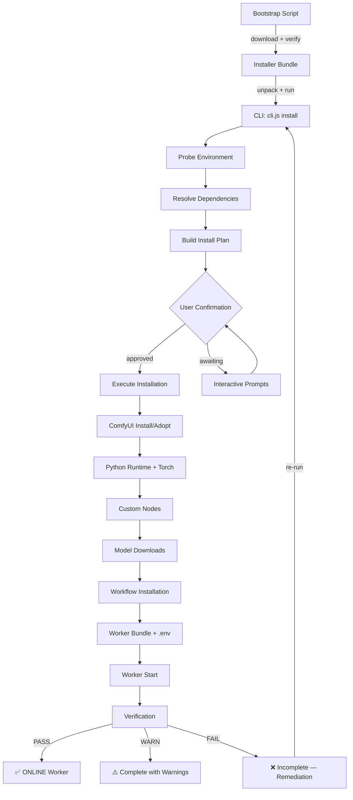
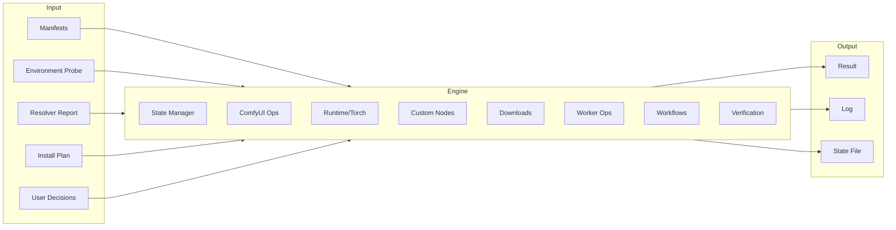

# Animastor Installer — Architecture

> **Version:** 1.0.0 (canonical — code audit, not design draft)
> **Status:** Current architecture as of HEAD (2026-08-30)
> **Installer version:** 1.3.0 (`backend/src/installer/package.json`)
>
> Этот документ описывает **фактически реализованную** архитектуру Animastor
> Installer на основе полного аудита кода, тестов и git-истории.
> Он НЕ является user manual и НЕ проектирует новую архитектуру.

---

## Table of Contents

1. [Purpose and Scope](#1-purpose-and-scope)
2. [Architectural Position](#2-architectural-position)
3. [Design Principles and Invariants](#3-design-principles-and-invariants)
4. [System Context](#4-system-context)
5. [Components](#5-components)
6. [Installation Lifecycle](#6-installation-lifecycle)
7. [Bootstrap Architecture](#7-bootstrap-architecture)
8. [Installer Engine](#8-installer-engine)
9. [Profiles and Manifests](#9-profiles-and-manifests)
10. [Installation Modes](#10-installation-modes)
11. [Runtime and Process Management](#11-runtime-and-process-management)
12. [Dependency Management](#12-dependency-management)
13. [ComfyUI Integration](#13-comfyui-integration)
14. [Custom Nodes](#14-custom-nodes)
15. [Models and Artifacts](#15-models-and-artifacts)
16. [Worker Installation and Configuration](#16-worker-installation-and-configuration)
17. [State, Idempotence and Self-Repair](#17-state-idempotence-and-self-repair)
18. [Verification and Health Model](#18-verification-and-health-model)
19. [Management Tools](#19-management-tools)
20. [GPU Hub Integration](#20-gpu-hub-integration)
21. [Security and Trust Boundaries](#21-security-and-trust-boundaries)
22. [Error Handling and Recovery](#22-error-handling-and-recovery)
23. [Testing Architecture](#23-testing-architecture)
24. [Architectural Invariants](#24-architectural-invariants)
25. [Current Limitations and Known Gaps](#25-current-limitations-and-known-gaps)
26. [Future Evolution Boundaries](#26-future-evolution-boundaries)
27. [Appendix: Important Files and Modules](#27-appendix-important-files-and-modules)

---

## 1. Purpose and Scope

Animastor Installer is a **declarative, idempotent installation system** that
turns a bare Linux GPU machine into a working Animastor Private Worker for a
specific Generation Profile (audio/image/video). One command → ComfyUI + Python
runtime + custom nodes + models + worker + .env → online worker.

**Scope:**
- Linux GPU servers (Ubuntu-based) only; Windows/macOS/Docker are planned
- One profile = one installation (multi-profile not yet implemented)
- Does NOT change runtime/orchestration/dispatch logic of the backend or GPU Hub
- Does NOT manage NVIDIA driver installation
- Does NOT install CUDA toolkit (checks presence, never installs)

**Non-scope:**
- User manual (see README and setup pages)
- GPU Hub provisioning for cloud providers (see `RunPod_Integration_GPU_Hub.md`)
- Backend/orchestration changes

**Source:** `backend/src/installer/` (12 modules + `engine/` subpackage with 12 modules)

---

## 2. Architectural Position

```
┌─────────────────────────────────────────────────────────────────┐
│                        Animastor Platform                        │
│  ┌──────────┐  ┌────────────┐  ┌──────────────────────────────┐ │
│  │ Frontend │  │  Backend   │  │         GPU Hub              │ │
│  │ (Web/    │→ │  (Routes,  │→ │  (Task dispatch, artifact    │ │
│  │  Android)│  │  Services) │  │   serving, worker registry)  │ │
│  └──────────┘  └────────────┘  └──────────┬───────────────────┘ │
│                                           │                     │
│                                           │  GET /installer     │
│                                           │  GET /worker-bundle │
│                                           │  GET /workflow/:id  │
│                                           ▼                     │
│                                ┌──────────────────────────┐     │
│                                │    GPU Machine            │     │
│                                │  ┌────────────────────┐  │     │
│                                │  │ Bootstrap Script    │  │     │
│                                │  │ (bash, from hub)    │  │     │
│                                │  └────────┬───────────┘  │     │
│                                │           ▼               │     │
│                                │  ┌────────────────────┐  │     │
│                                │  │ Installer CLI      │  │     │
│                                │  │ (cli.js)           │  │     │
│                                │  └────────┬───────────┘  │     │
│                                │           ▼               │     │
│                                │  ┌────────────────────┐  │     │
│                                │  │ Installer Engine    │  │     │
│                                │  │ (engine/)          │  │     │
│                                │  └────────┬───────────┘  │     │
│                                │           ▼               │     │
│                                │  ComfyUI + Worker + .env  │     │
│                                └──────────────────────────┘     │
└─────────────────────────────────────────────────────────────────┘
```

The installer sits **outside** the backend process. It runs independently on the
GPU machine. The backend's role is limited to:
- Serving manifests and instructions via the Setup Contract API
- Creating workers and issuing Worker Keys
- The GPU Hub serves bootstrap scripts and artifact bundles

**Source:** `backend/src/installer/cli.js` (entry point), `gpu-hub/gpu-hub.js` (artifact serving)

---

## 3. Design Principles and Invariants

### Core Principles

| Principle | Implementation |
|-----------|---------------|
| **Idempotent** | Every step is a pure function of (manifest, disk state) → action. Re-run after success = no-op with report. `backend/src/installer/engine/engine.js` |
| **Forward-only** | No full undo. State file tracks what was done; re-run continues from where it stopped. `backend/src/installer/engine/state.js` |
| **Disk is truth** | State file is an optimization; the engine re-checks disk before doing anything. `state.js: loadState()` |
| **No invented URLs** | Every download source comes from the manifest. Unknown sources → explicit BLOCKED. `backend/src/installer/download-planner.js` |
| **Safety by default** | Never delete, downgrade, or replace without explicit user confirmation. `backend/src/installer/safety-rules.js` |
| **Secrets never leak** | Worker Key enters via hidden input, registered for log redaction immediately, never in plan/state/reports/argv/logs. `safety-rules.js: SECRET_NAMES` |
| **Manifests are canonical** | Versions, checksums, and dependency definitions live in `backend/ai/install-manifests/`. No manual duplication. |
| **Workflows are optional** | Profile workflows are editable demo/test artifacts. Their absence never fails the installation verdict. `verification-report.js` |

### Architectural Invariants (extracted from code and tests)

These are rules whose violation would break the system. Source indicated.

| # | Invariant | Source |
|---|-----------|--------|
| 1 | Installer is idempotent: re-run never spawns duplicate ComfyUI/worker processes | `engine/comfyui.js: findManagedComfyUIPids()`, `engine/worker.js: findRunningWorkerPid()` |
| 2 | Foreign ComfyUI is never automatically connected to a worker | `engine/comfyui.js: findManagedComfyUIPids()` — CWD-verified via `/proc/<pid>/cwd` |
| 3 | Worker Key never appears in plan, state, reports, logs, or argv | `safety-rules.js: SECRET_NAMES`, `setup-contract.js: worker_key_policy` |
| 4 | Artifact integrity is always verified (SHA-256 when available, size otherwise) | `engine/downloader.js: verifyFile()` |
| 5 | Versions/manifests remain canonical; no manual version duplication | `setup-contract.js: getInstallerVersion()` reads from `package.json` only |
| 6 | Optional workflows never affect installation verdict | `verification-report.js: buildVerificationReport()` — workflows are `[INFO]` only |
| 7 | Self-repair is possible without manual intervention where architected | `engine/engine.js: retryDeps` (broken node deps auto-repaired on re-run) |
| 8 | Root/user ownership boundaries are enforced | `engine/prereq.js: checkOwnership()` — blocks sudo against user-owned paths |
| 9 | Managed runtime is tied to specific installation root | `engine/comfyui.js: findManagedComfyUIPids()` — CWD match required |
| 10 | Never auto-delete user models, custom nodes, or workflows | `safety-rules.js: NEVER_AUTOMATIC` — all deletion ops are `forbidden: true` |
| 11 | Never overwrite an existing valid Worker Key in .env | `safety-rules.js: NEVER_AUTOMATIC[overwrite_env_token]`, `engine/worker.js: configureEnv()` |
| 12 | .env file always has chmod 600 | `engine/worker.js: configureEnv()` — `io.fs.chmodSync(envPath, 0o600)` |
| 13 | State file is scrubbed of secrets before persistence | `engine/state.js: scrubSecrets()` |
| 14 | Dry-run performs zero mutations | `engine/io.js: createDryRunIo()` — every write/exec throws |
| 15 | ComfyUI always listens on 127.0.0.1 only | `engine/comfyui.js: startComfyUI()` — `--listen 127.0.0.1` |
| 16 | CPU mode is explicit, never silent | `engine/engine.js: CPU_MODE_WARNING` — logged when no GPU detected |

---

## 4. System Context

### Data Flow

```
[offline, in repository]
  Production workflows ──scan──► dependency table (research, human)
                                        │
  Profiles ────────────────────────────►│
                                        ▼
                          Canonical Install Manifest (vX.Y.Z)
                                        │
                                        ▼
[on GPU machine, via hub]
  Bootstrap script ──download──► Installer bundle ──verify──► Real installer
                                        │
                                        ▼
                          Environment Probe → Resolver → Plan → Engine → Verify
                                        │
                                        ▼
                                ComfyUI + Models + Nodes + Worker → ONLINE
```

### Communication Boundaries

| Boundary | Protocol | Direction | Security |
|----------|----------|-----------|----------|
| Backend → Hub | HTTP POST `/task`, `/task/result`, `/task/error` | Backend → Hub | `x-api-key` header (FAIL CLOSED) |
| Worker → Hub | HTTP GET `/task/next`, POST `/beacon` | Worker → Hub | `Authorization: Bearer wrk.*` (FAIL CLOSED) |
| Hub → Backend | HTTP POST `/gpu/task/result`, `/gpu/task/error` | Hub → Backend | `x-api-key` header |
| Frontend → Backend | HTTP GET `/api/v1/private-worker/setup/*` | Frontend → Backend | Session auth |
| Installer → Hub | HTTP GET `/installer/bundle`, `/installer/sha256`, `/worker-bundle/sha256` | Installer → Hub | Public (no secrets in bundles) |
| Installer → Hub | HTTP POST `{api}/worker/verify` | Installer → Hub | Worker Key in header |

---

## 5. Components

### 5.1 Core Modules (`backend/src/installer/`)

| Module | Responsibility | Key Functions |
|--------|---------------|---------------|
| `index.js` | Barrel export of all installer modules | — |
| `install-manifest.js` | Load + validate canonical install manifests | `loadManifest()`, `validateManifest()`, `loadAllManifests()` |
| `compatibility-resolver.js` | Pure resolution: required ∪ installed → missing/incompatible/etc | `resolveInstallation()` |
| `install-plan.js` | Build interactive installation flow from resolver report | `buildInstallPlan()`, `renderPlanText()` |
| `download-planner.js` | Pure download spec planning (no network) | `planModelDownload()`, `estimateMissingBytes()` |
| `workflow-artifacts.js` | Baseline workflow planning (pure, editable-baseline policy) | `planWorkflowDownloads()`, `summarizeWorkflowState()` |
| `safety-rules.js` | Declarative safety model + secret redaction | `confirmationGate()`, `assertSafeReport()`, `redactSecrets()` |
| `verification-report.js` | Post-install verification verdict | `buildVerificationReport()` |
| `setup-contract.js` | UI-safe projection for frontend consumption | `listSetupProfiles()`, `getInstallationMethods()`, `buildInstructions()`, `probeHubArtifacts()` |
| `management.js` | Runtime management (status/monitor/reboot) + tool installation | `collectStatus()`, `restartWorker()`, `restartComfyUI()`, `installManagementTools()` |
| `cli.js` | CLI entry point: detect/plan/install/verify/resume/uninstall | `runInstallation()` dispatch |
| `uninstaller.js` | Ownership-aware removal of installer-created components | `uninstall()` |
| `package.json` | Canonical installer version (`1.3.0`) | `version` field |

### 5.2 Engine (`backend/src/installer/engine/`)

| Module | Responsibility | Key Functions |
|--------|---------------|---------------|
| `engine.js` | Orchestrator: probe → resolve → plan → execute → verify | `runInstallation()`, `createInterruptGuard()` |
| `probe.js` | Environment detection (GPU, ComfyUI, Python, Torch, Node.js, nodes, models, workflows, worker) | `probeEnvironment()`, `probeNvidiaGpu()`, `probeComfyui()`, `probeWorker()` |
| `comfyui.js` | ComfyUI install/update/adopt/start/restart + Python runtime + torch pin | `installComfyUI()`, `adoptComfyUI()`, `preparePythonRuntime()`, `restartManagedComfyUI()`, `syncComfyUIRequirements()` |
| `nodes.js` | Custom node installation (git clone + pip requirements) | `installCustomNodes()`, `installCustomNode()` |
| `downloader.js` | Model download with retry/resume/verify + ModelScope adapter | `downloadArtifact()`, `downloadModelScopeRepo()`, `verifyFile()` |
| `worker.js` | Worker bundle deploy, .env config, start/stop/restart, hub verification | `installWorkerBundle()`, `configureEnv()`, `startWorker()`, `stopManagedWorker()`, `restartManagedWorker()` |
| `workflows.js` | Baseline workflow installation (repo path or hub endpoint) | `installWorkflows()`, `readCanonicalContent()` |
| `state.js` | Install state persistence (JSON, atomic writes, secret scrubbing) | `emptyState()`, `loadState()`, `saveState()`, `setArtifact()` |
| `io.js` | IO abstraction (real / memory-fs for tests / dry-run guard) | `createRealIo()`, `createMemoryFs()`, `createDryRunIo()` |
| `prereq.js` | Host prerequisite checks (venv, build tools, ownership) | `checkPythonPrerequisites()`, `checkBuildPrerequisites()`, `checkOwnership()` |
| `progress.js` | Download progress reporting (TTY-aware) | `createProgressReporter()` |
| `term.js` | Terminal renderer with busy spinner | `createTermRenderer()` |
| `logger.js` | Logging with secret redaction | `createLogger()` |

---

## 6. Installation Lifecycle

The installation proceeds through these phases. Each phase is a step in the
install plan (`install-plan.js: FLOW_STEPS`).

```
┌─────────────────────────────────────────────────────────────────┐
│                     Installation Lifecycle                       │
│                                                                 │
│  Phase 0: Preflight                                             │
│    ├─ OS/arch check                                             │
│    ├─ GPU detection (nvidia-smi)                                │
│    ├─ Disk space check                                          │
│    └─ Ownership guard (UID check)                               │
│                                                                 │
│  Phase 1: Environment Detection                                 │
│    ├─ probe.probeEnvironment()                                  │
│    ├─ ComfyUI presence + version                                │
│    ├─ Python/Torch/CUDA/Node.js versions                        │
│    ├─ Custom nodes scan                                         │
│    ├─ Models scan                                               │
│    └─ Worker bundle + .env status                               │
│                                                                 │
│  Phase 2: Resolution                                            │
│    ├─ resolver.resolveInstallation()                            │
│    ├─ Mode: managed | existing | shared                         │
│    └─ Per-entry: installed/missing/incompatible/unknown         │
│                                                                 │
│  Phase 3: Planning                                              │
│    ├─ plan.buildInstallPlan()                                   │
│    ├─ 12-step interactive flow                                  │
│    └─ User confirmation gates                                   │
│                                                                 │
│  Phase 4: Execution (engine.runInstallation())                  │
│    ├─ 4.0 Host gates (ownership, Python prereqs)               │
│    ├─ 4.1 ComfyUI install/update/adopt                         │
│    ├─ 4.2 Python runtime (venv + torch pin)                    │
│    ├─ 4.3 Custom nodes (git clone + pip)                        │
│    ├─ 4.4 Models (download + verify)                            │
│    ├─ 4.5 Baseline workflows                                    │
│    ├─ 4.6 Worker bundle deploy                                  │
│    ├─ 4.7 Worker Key + .env configuration                       │
│    ├─ 4.8 Worker start                                          │
│    └─ 4.9 Verification                                          │
│                                                                 │
│  Phase 5: Verification                                          │
│    ├─ Worker process alive                                      │
│    ├─ Worker registration (hub verify endpoint)                 │
│    ├─ ComfyUI /system_stats reachable                           │
│    └─ Verification report (PASS/WARN/FAIL)                      │
└─────────────────────────────────────────────────────────────────┘
```

**Source:** `backend/src/installer/engine/engine.js: runInstallation()` (lines 1-897+)

### Lifecycle Mermaid Diagram



---

## 7. Bootstrap Architecture

### Bootstrap Script (`gpu-hub/bootstrap.js`)

The hub serves a small, auditable bash script at `GET /gpu/installer`. The user
runs it on the GPU machine.

**Execution flow:**

1. Resolve `HUB_URL` / `PROFILE` / `MODE` (embedded at download time, overridable via env)
2. Check prerequisites: `curl`/`wget`, `tar`, `sha256sum`, `Node.js >= 20`
3. Download installer bundle from `{HUB_URL}/installer/bundle`
4. Verify SHA-256 against `{HUB_URL}/installer/sha256`
5. Unpack into temp directory (wiped on exit)
6. Run real installer: `node cli.js install --profile <p> --mode <m>`
7. Worker Key is asked interactively by the installer (hidden input)

**Security model:**
- NO credential in the script, download URL, argv, env, or output
- Credential-bearing env names (`ANIMASTOR_WORKER_TOKEN`, etc.) are actively **rejected** (fail closed)
- Bundle checksum is verified before anything is executed
- Everything unpacked into temp dir wiped on exit

**Source:** `gpu-hub/bootstrap.js: buildBootstrapScript()`, `gpu-hub/gpu-hub.js: GET /installer`

### Hub Artifact Serving (`gpu-hub/gpu-hub.js`)

| Endpoint | Purpose | Auth |
|----------|---------|------|
| `GET /installer` | Bootstrap shell script | Public |
| `GET /installer/bundle` | Installer tar.gz package | Public |
| `GET /installer/sha256` | Installer checksum + version | Public |
| `GET /worker-bundle` | Worker runtime bundle (tar.gz) | Public |
| `GET /worker-bundle/sha256` | Bundle checksum + version | Public |
| `GET /workflow/:id` | Baseline workflow JSON | Public (allowlisted) |
| `GET /worker-source` | Single worker.cjs (DEPRECATED) | Public |

**Source:** `gpu-hub/gpu-hub.js` (lines 735-1000+), `gpu-hub/tarball.js`

---

## 8. Installer Engine

The engine (`backend/src/installer/engine/engine.js`) is the execution layer.
It receives the already-computed install plan and executes ONLY the operations
the plan allows.

### Engine Architecture



### Key Design Decisions

**IO Abstraction (`engine/io.js`):**
- Every side effect goes through an `io` object
- Production: `createRealIo()` (real filesystem, processes, HTTP)
- Tests: `createMemoryFs()` + scripted exec results
- Dry-run: `createDryRunIo()` — wraps real io, throws on ANY mutation

**Interrupt Guard (`engine/engine.js: createInterruptGuard`):**
- On SIGINT: marks state as interrupted, marks in-flight artifact as `partial`
- Partial `.part` files stay on disk and resume on next run
- Second Ctrl+C: force exit (code 130)

**Device Branching:**
- `device = 'cuda'` when NVIDIA GPU detected via nvidia-smi
- `device = 'cpu'` when no supported GPU (AMD → explicit note, CPU fallback)
- CPU mode installs CPU-only PyTorch and runs ComfyUI with `--cpu`

**Source:** `backend/src/installer/engine/engine.js`

---

## 9. Profiles and Manifests

### Manifest Location and Schema

**Location:** `backend/ai/install-manifests/{type}/{name}.json`

| Profile | File | Status |
|---------|------|--------|
| `audio/qwen-tts` | `backend/ai/install-manifests/audio/qwen-tts.json` | draft |
| `image/qwen-image` | `backend/ai/install-manifests/image/qwen-image.json` | draft |
| `video/ltx-2.3` | `backend/ai/install-manifests/video/ltx-2.3.json` | draft |

### Manifest Schema (v1.0.0)

```jsonc
{
  "manifest_version": "1.0.0",      // schema version
  "revision": "2026.08.27-r1",       // monotonic content revision
  "profile": {
    "id": "video/ltx-2.3",          // "{type}/{name}"
    "type": "video",
    "name": "ltx-2.3"
  },
  "hardware": { "gpu_min_vram_gb": 24 },
  "runtime_requirements": {
    "comfyui": { "policy": "exact-pin-preferred", "pin": {...}, "basis": "..." },
    "python":  { "policy": "minimum", "minimum": "3.10", "basis": "..." },
    "torch":   { "pin": "2.6.0+cu124", "index_url": "...", "cpu": {...} },
    "nodejs":  { "policy": "minimum", "minimum": "20", "basis": "..." },
    "nvidia_driver": { "policy": "reference-only", "basis": "..." }
  },
  "dependencies": [
    // kind: "model" | "model_repo" | "custom_node" | "python_package"
    // requirement: "required" | "optional" | "unknown"
    // basis: "required" | "known_working" | "minimum_supported" | "optional" | ...
  ],
  "workflows": {
    "policy": "editable-baseline",
    "baseline_dir": "user/default/workflows/animastor",
    "artifacts": [{ "id": "workflow:...", "baseline_sha256": "..." }]
  },
  "worker_bundle": {
    "files": ["worker.cjs", "package.json", ...],
    "env": {
      "required": ["HUB_URL", "ANIMASTOR_WORKER_TOKEN", "WORKER_TYPE", "WORKER_ID"],
      "secrets": ["ANIMASTOR_WORKER_TOKEN"]
    }
  },
  "verification": { "method": "resolver-diff" }
}
```

### Evidence Taxonomy

Each manifest entry carries a `basis` field classifying its provenance:

| Basis | Meaning |
|-------|---------|
| `required` | Required by production workflows (workflow-derived) |
| `known_working` | Verified present & working on a known instance |
| `minimum_supported` | Minimal admissible configuration |
| `optional` | Not required; utility / "for growth" |
| `environment_reference` | Provider/image-specific reference, never canonical |
| `unknown` | Insufficient data; explicit TODO |

**Key principle:** Runtime audits are reference/verification material only —
they are NEVER the source of truth. Production workflows are the single
source of `required`.

**Source:** `backend/src/installer/install-manifest.js: BASIS_VALUES`, `validateManifest()`

---

## 10. Installation Modes

| Mode | ComfyUI | Worker | Root | Typical Use | Limitations |
|------|---------|--------|------|-------------|-------------|
| **Managed** | Installer creates + owns | Installer deploys + starts | `$HOME/animastor/comfyui/` | Clean GPU machine, full automation | One profile per root |
| **Existing** | Detected, never touched | Installer deploys + configures | User's existing ComfyUI | User already has ComfyUI installed | Never replaces/downgrades user's components |
| **Isolated** | Data model only (interface) | Same as managed | Independent roots | One GPU, N independent ComfyUI envs | Not yet implemented (data model + interface only) |
| **Shared** | One ComfyUI, N profiles | Union + compatibility check | Shared root | Multiple profiles sharing one ComfyUI | Conflict → "Isolation recommended" |

### Managed Mode Details

- Installer fully owns the environment
- Creates ComfyUI from manifest pin (git clone + checkout)
- Creates Python venv under `<root>/venv/`
- Installs torch with CUDA/CPU index
- Installs custom nodes + models
- Deploys worker bundle + .env
- Starts ComfyUI + worker processes
- Default: `startComfyui = true`, `startWorker = true`

### Existing Mode Details

- Detects user's ComfyUI, Python, Torch, CUDA, custom nodes, models
- Reports what is found vs. what is needed
- NEVER replaces, downgrades, or removes user's components
- Only installs MISSING components with user approval
- Worker bundle still deployed; .env created with merge semantics

### Isolated Mode Details

- Data model defined in `compatibility-resolver.js` (RUNTIME_MODES includes 'isolated')
- Interface exists but full implementation is deferred
- Each environment resolves independently under its own root

**Source:** `backend/src/installer/compatibility-resolver.js: RUNTIME_MODES`, `setup-contract.js: INSTALL_MODES`

---

## 11. Runtime and Process Management

### ComfyUI Process Management

**Discovery:** `engine/comfyui.js: findManagedComfyUIPids()`
- Scans `/proc/<pid>/cmdline` for `main.py`
- Matches by CWD (`/proc/<pid>/cwd` must equal the installation root)
- Optional port match from `--port` argument
- **Never signals foreign ComfyUI processes** (different root)

**Start:** `engine/comfyui.js: startComfyUI()`
- Runs `python main.py --listen 127.0.0.1 --port <N>` as detached daemon
- CPU mode adds `--cpu` flag
- Log file: `<root>/comfyui-installer.log`

**Restart:** `engine/comfyui.js: restartManagedComfyUI()`
- Sends SIGTERM to managed PIDs, waits 15s, SIGKILL if needed
- Starts fresh instance + waits for API (`/system_stats`)
- Used after custom node changes (nodes import only at startup)

### Worker Process Management

**Discovery:** `engine/worker.js: findRunningWorkerPid()`
- `pgrep -f worker\.cjs` → verify each candidate via `/proc/<pid>/cwd`
- CWD must match `workerDir` exactly

**Start:** `engine/worker.js: startWorker()`
- `node worker.cjs` as detached daemon
- Idempotent: if already running for this dir, skip
- If `.env` changed after process start → kill and restart (stale config)

**Stop:** `engine/worker.js: stopManagedWorker()`
- UID guard: refuses to signal a foreign-uid process
- SIGTERM → wait → SIGKILL

**Restart:** `engine/worker.js: restartManagedWorker()`
- Stop (if running) + Start
- Correctly handles already-stopped case

### Port Selection

**Source:** `engine/engine.js: autoPickComfyPort()`
- Checks if the remembered port is used by a foreign service
- If yes → picks a new one
- Persisted in `install-state.json: installer_options.comfyPort`
- Default: 8188 (but auto-picked to avoid conflicts)

---

## 12. Dependency Management

### Dependency Kinds

| Kind | Source | Mechanism |
|------|--------|-----------|
| `comfyui` | GitHub (`comfyanonymous/ComfyUI`) | `git clone` + `git checkout` |
| `python_package` | PyPI / PyTorch index | `pip install` with constraints |
| `custom_node` | GitHub repos | `git clone` + `git checkout` + pip requirements |
| `model` | Hugging Face (single file) | HTTP download + SHA-256 verify |
| `model_repo` | ModelScope (repo snapshot) | REST API listing + per-file download |
| `runtime` | System packages | Detection only (never installed) |

### Torch Compatibility Strategy

**Source:** `engine/comfyui.js: preparePythonRuntime()`, `syncComfyUIRequirements()`

1. Torch is installed BEFORE `requirements.txt` (pins the CUDA/CPU build first)
2. `requirements.txt` typically carries UNPINNED torch/torchvision/torchaudio
3. Constraint file (`.animastor-torch-constraints.txt`) pins torch to manifest version
4. Range-pins for torchvision/torchaudio prevent ABI drift:
   - `torch 2.N` → `torchvision 0.(N+15)` → `torchaudio 2.N`
5. For adopted ComfyUI (pre-existing venv): sync pass ensures deps are present
6. ABI-matched builds verified: if torchvision lacks `+cpu` local tag, force-reinstall from torch index

### Model Download Contract

**Source:** `engine/downloader.js: downloadArtifact()`, `download-planner.js`

1. Download into `<target>.part` (never treat partial file as ready)
2. Resume via HTTP Range when source supports it
3. Verify: SHA-256 > size > presence (cascade)
4. Atomic rename `.part` → final on success
5. Retry with backoff (default 3 attempts)
6. Idempotent: verified final file is never re-downloaded
7. Corrupt/mismatched → delete and re-download

---

## 13. ComfyUI Integration

### Version Policy

**Source:** `install-manifest.js: runtime_requirements.comfyui`

| Situation | Action |
|-----------|--------|
| No ComfyUI | Clone + checkout `required_version` (or known-working reference with consent) |
| Version == required | Skip (OK) |
| Version < min | Prompt update; decline → abort |
| Version > max_tested | Prompt: keep (at own risk) or downgrade (with consent + checkpoint) |
| Unknown version | User must review |

### ComfyUI Ownership Model

- `st.components.comfyui.owned = true` → installer created the directory (can be removed)
- `st.components.comfyui.owned = false` → pre-existing (never removed by uninstaller)
- `adoptComfyUI()` handles partial installs from earlier runs (init git in existing root)

### ComfyUI Restart Trigger

ComfyUI imports custom nodes ONLY at startup. When the installer changes nodes,
it restarts the managed instance so `/object_info` reflects the new files.
Source: `engine/engine.js` (after custom nodes step), `engine/comfyui.js: restartManagedComfyUI()`

---

## 14. Custom Nodes

### Installation Flow

**Source:** `engine/nodes.js: installCustomNodes()`

For each required node:
1. Check presence (directory exists under `ComfyUI/custom_nodes/`)
2. If missing: `git clone` from manifest source → `git checkout` pinned commit
3. Install Python dependencies (requirements.txt) with torch constraint
4. Re-check presence

### Self-Repair

Nodes left with "python dependencies incomplete" by an earlier run get an
idempotent pip retry on re-run. This runs even when the plan step is a noop,
because the resolver keys node presence off the directory — a present-but-broken
node produces no install action and without this retry the broken state would
never heal.

**Source:** `engine/engine.js` — `retryDeps` logic (after step 4.3)

### Origin Tracking

- `origin: 'installed'` → installer created this directory (registered in state)
- `origin: 'pre-existing'` → was already on disk (never removed by uninstaller)

---

## 15. Models and Artifacts

### Model Source Types

| Source | Mechanism | Auth |
|--------|-----------|------|
| Hugging Face (single file) | HTTP download with Range resume | Optional `HF_TOKEN` for gated models |
| ModelScope (repo snapshot) | REST API listing + per-file download | Optional `MODELSCOPE_API_TOKEN` |

### Download Safety

- `.part` files for interrupted downloads (resume on re-run)
- SHA-256 verification when manifest provides checksum
- Size verification (±5% tolerance) when checksum unavailable
- Atomic publish: `.part` → final only after full verification
- Checksum mismatch → delete + fail step (never continue with corrupt model)

**Source:** `engine/downloader.js: verifyFile()`, `downloadArtifact()`

### ModelScope Integration

- `installer_preload`: installer pre-downloads the full repo (deterministic/offline)
- `node_auto_download`: custom node downloads on first run (installer verifies presence)
- File listing via ModelScope REST API with recursive directory traversal

**Source:** `engine/downloader.js: downloadModelScopeRepo()`, `listModelScopeFiles()`

---

## 16. Worker Installation and Configuration

### Worker Bundle

**Source:** `engine/worker.js: installWorkerBundle()`

Files deployed to `<workerDir>/`:
- `worker.cjs` — main worker runtime
- `worker-cleanup.cjs` — cleanup logic
- `worker-cleanup-journal.cjs` — journal for cleanup
- `package.json` + `package-lock.json` — npm dependencies
- `.env.example` — template

**Source priority** (never invented):
1. Repo checkout (`worker/worker/`)
2. Hub bundle (`GET /worker-bundle` — sha256-verified tar.gz)
3. Hub single-file (`GET /worker-source` — DEPRECATED)

### .env Configuration

**Source:** `engine/worker.js: configureEnv()`

- **Merge semantics**: existing keys are preserved; missing required keys are appended
- **Worker Key never overwritten** if already present and valid
- **chmod 600** on .env file
- **Runtime settings updated on every run**: `COMFY_PORT`, `WORKER_TYPE` etc. reach .env on every re-run

### Worker Key Lifecycle

1. Created via `POST /api/v1/workers` (backend) — shown ONCE
2. Entered on GPU machine via installer's hidden input
3. Written to `.env` (merge semantics, never overwritten)
4. Used by worker for `Authorization: Bearer wrk.<id>.<secret>` on hub calls
5. Never in logs, argv, state files, or setup contract responses

**Source:** `setup-contract.js: worker_key_policy`, `engine/worker.js: configureEnv()`

### Worker Registration Verification

**Source:** `engine/worker.js: verifyRegistration()`

```
POST {apiBase}/worker/verify
Authorization: Bearer <token>
→ { verified: true, worker_id, worker_type, mode }
```

---

## 17. State, Idempotence and Self-Repair

### State File

**Location:** `<stateDir>/install-state.json`
**Source:** `engine/state.js`

```jsonc
{
  "state_version": 1,
  "created": "2026-08-30T...",
  "updated": "2026-08-30T...",
  "mode": "managed",
  "profiles": ["video/ltx-2.3"],
  "root": "/home/user/animastor/comfyui",
  "device": "cuda",
  "owner_uid": 1000,
  "decisions": { "comfyui_update": "yes", "install_custom_nodes": true, ... },
  "artifacts": {
    "comfyui": { "status": "installed", "at": "...", "detail": { "ref": "v0.27.0" } },
    "runtime": { "status": "installed", ... },
    "model:xyz": { "status": "installed", ... }
  },
  "components": {
    "comfyui": { "owned": true, "path": "...", "ref": "v0.27.0" },
    "venv": { "owned": true, "path": ".../venv" },
    "worker": { "owned": true, "dir": "...", "files_installed": [...], "env_created": true },
    "custom_nodes": [{ "id": "...", "path": "...", "created": true }],
    "models": [{ "id": "...", "path": "...", "created": true, "files": [...] }],
    "workflows": [{ "id": "...", "path": "..." }],
    "services": []
  },
  "installer_options": { "comfyPort": 8188, "startComfyui": true, "startWorker": true },
  "checkpoints": [{ "at": "...", "kind": "comfyui-version-change", ... }]
}
```

### Artifact Statuses

| Status | Meaning |
|--------|---------|
| `missing` | Not present on disk |
| `partial` | Download interrupted (`.part` file exists) |
| `installed` | Present and meets manifest expectations |
| `verified` | Present + checksum verified |
| `failed` | Attempted but failed (with reason) |

### Idempotency Rules

1. Every step = pure function of (manifest, actual disk state) → action
2. Check-before-do everywhere: presence, version, checksum
3. Re-run after success = no-op with report
4. State file is optimization; disk is truth
5. `resume` continues from saved state without re-prompting decisions

### Self-Repair

- Broken node deps → auto-repaired on re-run (`retryDeps`)
- Broken venv → quarantined + fresh venv created
- Stale worker → restarted when .env changed after process start
- Interrupted download → `.part` file resumes on next run

---

## 18. Verification and Health Model

### Verification Report

**Source:** `verification-report.js: buildVerificationReport()`

The verification checks:

| Check | Source | Severity |
|-------|--------|----------|
| GPU present + VRAM sufficient | `probe.probeEnvironment()` | FAIL if missing; WARN if insufficient |
| ComfyUI installed | resolver report | FAIL if missing |
| ComfyUI running | `GET /system_stats` | WARN if not checked |
| ComfyUI API reachable | `GET /system_stats` | WARN if not checked |
| Custom nodes installed | resolver report | FAIL if required node missing |
| Models installed | resolver report | FAIL if required model missing |
| Profile workflows | resolver report | **INFO only** (never FAIL/WARN) |
| Worker process alive | `findRunningWorkerPid()` | WARN if not checked |
| Worker registered | `POST /worker/verify` | WARN if not checked |
| GPU Hub connection | — | WARN if not checked |

### Verdict Logic

```
FAIL  ← any required entry is missing or incompatible
WARN  ← any entry has unknown/required status
PASS  ← all entries are installed
```

**Key exception:** Profile workflows are optional demo/test artifacts.
Their absence is reported as `[INFO]` and never affects the verdict.

---

## 19. Management Tools

### Installed Tools

**Source:** `management.js: TOOL_SCRIPTS`, `installManagementTools()`

| Script | Command | Purpose |
|--------|---------|---------|
| `tools/status.sh` | `status` | Show worker/ComfyUI/API status |
| `tools/reboot-worker.sh` | `reboot-worker` | Restart worker (uid-guarded) |
| `tools/reboot-comfyui.sh` | `reboot-comfyui` | Restart ComfyUI (uid-guarded) |
| `tools/comfyui-monitor.sh` | `monitor` | ComfyUI queue + errors + stats |

### Safety Invariants for Tools

- **No global pkill/killall**: only cwd-verified managed processes are signaled
- **UID guard**: only processes owned by the current account are signaled
- **Cross-tenant safety**: ownership guard same as installer
- **Read-only tools** (status/monitor) never write state
- **Reboot tools** write only runtime log files

### Status Collection

**Source:** `management.js: collectStatus()`

Reuses installer engine primitives:
- `worker.findRunningWorkerPid()` — CWD-verified
- `comfyui.findManagedComfyUIPids()` — CWD-verified (foreign ComfyUI on same port → never reported as ours)
- `comfyui.systemStats()` — `GET /system_stats`
- Queue: `GET /queue` (running/pending counts)

### Monitor Collection

**Source:** `management.js: collectMonitor()`

- `GET /system_stats` — API reachability
- `GET /queue` — running/pending jobs
- `GET /history?max_items=24` — recent errors (fallback: plain `/history`)
- Graceful fallback: unavailable data → "—" (never invented)

---

## 20. GPU Hub Integration

### Hub Endpoints Used by Installer

| Endpoint | Used By | Purpose |
|----------|---------|---------|
| `GET /installer` | User (browser) | Bootstrap shell script |
| `GET /installer/bundle` | Bootstrap script | Installer tar.gz |
| `GET /installer/sha256` | Bootstrap script | Installer checksum |
| `GET /worker-bundle` | Engine (`worker.js`) | Worker runtime bundle |
| `GET /worker-bundle/sha256` | Engine + Bootstrap | Bundle checksum |
| `GET /workflow/:id` | Engine (`workflows.js`) | Baseline workflow JSON |
| `POST {api}/worker/verify` | Engine (`worker.js`) | Worker registration check |

### Hub Probing

**Source:** `setup-contract.js: probeHubArtifacts()`

The setup contract probes the hub for real artifact availability:
- `GET /worker-bundle/sha256` → available + version + sha256
- `GET /installer/sha256` → available + version + sha256

An artifact is `available: true` ONLY when the hub actually serves it.
No fake download URLs are ever generated.

---

## 21. Security and Trust Boundaries

### Worker Key Safety

| Rule | Implementation |
|------|---------------|
| Entered via hidden input only | `engine/engine.js: secretProvider` |
| Never in plan/state/reports | `safety-rules.js: SECRET_NAMES` |
| Never in argv/logs/URLs | `setup-contract.js: worker_key_policy` |
| Never overwritten in .env | `safety-rules.js: NEVER_AUTOMATIC[overwrite_env_token]` |
| .env has chmod 600 | `engine/worker.js: configureEnv()` |
| State file scrubbed of secrets | `engine/state.js: scrubSecrets()` |
| Bootstrap rejects credential env vars | `gpu-hub/bootstrap.js` — fail-closed loop |

### Download Security

- HTTPS only for all downloads
- SHA-256 verification when available
- Size sanity check (±5% tolerance) when checksum unavailable
- ModelScope/HF tokens used in request headers only, never logged

### Network Security

- ComfyUI listens on `127.0.0.1` only (never 0.0.0.0)
- Worker communicates outbound only (to Hub)
- No ports opened by installer on the machine

### Ownership Security

- UID guard prevents sudo-against-user-user mixing
- Ownership tracked in state: `owner_uid`
- Tools enforce same UID rules as installer
- Foreign processes (different UID) are never signaled

**Source:** `engine/prereq.js: checkOwnership()`, `engine/worker.js: stopManagedWorker()`

---

## 22. Error Handling and Recovery

### Failure Taxonomy

| Scenario | Policy | Source |
|----------|--------|--------|
| ComfyUI absent | Install from manifest pin | `engine.js` step 4.1 |
| ComfyUI below minimum | Prompt update; decline → abort | `install-plan.js: buildComfyuiStep()` |
| ComfyUI above max_tested | Prompt: keep or downgrade | `install-plan.js` |
| Runtime cannot be prepared | Fatal: skip all dependent steps | `engine.js: runtimeFatal` |
| Download interrupted | `.part` file, resume on re-run | `engine/downloader.js` |
| Checksum mismatch | Delete + fail step | `engine/downloader.js: verifyFile()` |
| Worker registration failure | Distinguish: wrong token → re-prompt; network → retry; type mismatch → message | `engine.js` step 4.9 |
| Ctrl+C during install | Mark interrupted + partial artifact, save state, exit 130 | `engine.js: createInterruptGuard()` |
| Partial installation | State file tracks each step; `--resume` continues; bare re-run also safe | `engine/state.js` |

### Rollback Strategy

- **Forward-only** with checkpoints (no full undo — multi-GB models are impractical to roll back)
- Before ComfyUI version change: checkpoint previous commit
- `--rollback-last` for ComfyUI version rollback (models untouched)
- Any FAIL leaves machine in consistent state: partial `.part` files deleted, state marks step as failed

### Remediation Model

**Source:** `engine/prereq.js: PrerequisiteError`

When a prerequisite fails, the installer produces a structured remediation:
- `code`: machine-readable error code (e.g. `MISSING_VENV_PACKAGE`)
- `summary`: human-readable description
- `hostPackage`: exact apt package name
- `remediationCommand`: exact command to fix (e.g. `sudo apt install python3.10-venv`)

---

## 23. Testing Architecture

### Test Files

| Test File | Coverage | Style |
|-----------|----------|-------|
| `installer-engine.test.js` | 20 mocked execution scenarios (dry-run + real) | Mock io, no real downloads |
| `installer-setup-contract.test.js` | Setup contract projections (profiles, methods, instructions, plan) | Real manifests |
| `installer-resume.test.js` | Resume/re-run semantics | Mock io |
| `installer-security.test.js` | Safety rules, secret redaction, forbidden ops | Unit tests |
| `installer-cpu.test.js` | CPU-only installation path | Mock io |
| `installer-cli.test.js` | CLI argument parsing | Unit tests |
| `installer-management-tools.test.js` | Status/monitor/reboot tools | Mock io |
| `installer-resolver.test.js` | Compatibility resolver logic | Unit tests |
| `installer-prereq.test.js` | Python prerequisite checks | Mock io |
| `installer-term.test.js` | Terminal renderer | Unit tests |
| `installer-modelscope.test.js` | ModelScope download adapter | Mock io |
| `installer-phase15.test.js` | Phase 1.5 features (existing, workflows) | Mock io |
| `installer-busy.test.js` | Busy spinner for subprocess steps | Unit tests |
| `gpu-hub-bootstrap.test.js` | Bootstrap script generation | Unit tests |
| `gpu-hub-artifacts.test.js` | Hub artifact serving | Unit tests |
| `worker-setup-api.test.js` | Worker setup API routes | Integration |
| `worker-bundle-env.test.js` | Worker bundle .env handling | Unit tests |
| `worker-cleanup.test.js` | Worker cleanup logic | Unit tests |

### Test as Architecture Contracts

Tests serve as **executable architecture contracts** — they verify:
1. Dry-run performs zero mutations (`installer-engine.test.js` test 20)
2. Safety report never contains destructive operations (`installer-security.test.js`)
3. Secret values never appear in logs (`installer-engine.test.js` test 19)
4. Existing customized workflows are never overwritten (`installer-engine.test.js` test 10)
5. Optional workflows don't affect installation verdict (`installer-engine.test.js` test 10b)
6. Resume continues from saved state (`installer-resume.test.js`)
7. Ownership guard blocks sudo mixing (`installer-prereq.test.js`)
8. Bootstrap rejects credential env vars (`gpu-hub-bootstrap.test.js`)
9. Setup contract never exposes raw manifests (`installer-setup-contract.test.js`)
10. Model downloads are idempotent (`installer-engine.test.js` tests 15-16)

### Mock Architecture

All tests use the IO abstraction (`engine/io.js`):
- `createMemoryFs(initial)` — in-memory filesystem
- Scripted `execResults` and `httpResults` — deterministic side effects
- `createDryRunIo(io)` — wraps any io, throws on mutations

No real GPU, network, or downloads required for CI.

---

## 24. Architectural Invariants

### Hard Invariants (violation breaks the system)

| # | Invariant | Enforcement | Test |
|---|-----------|-------------|------|
| H1 | Installer is idempotent | check-before-do everywhere | `installer-engine.test.js` |
| H2 | Re-run never spawns duplicate processes | `findRunningWorkerPid()` + `findManagedComfyUIPids()` | `installer-engine.test.js:19` |
| H3 | Worker Key never leaks | `SECRET_NAMES` + redaction + state scrub | `installer-security.test.js` |
| H4 | Artifact integrity verified | `verifyFile()` (SHA-256 → size → presence) | `installer-engine.test.js:16` |
| H5 | Manifests are canonical | Versions read from `package.json` only | `setup-contract.test.js` |
| H6 | Optional workflows never fail verdict | `verification-report.js: infoLine()` | `installer-engine.test.js:10b` |
| H7 | Root/user ownership boundaries enforced | `checkOwnership()` blocks sudo mixing | `installer-prereq.test.js` |
| H8 | No invented URLs/sources | `download-planner.js: BLOCKED` for unresearched sources | `installer-engine.test.js:8` |
| H9 | Foreign processes never signaled | CWD-verified PID discovery | `installer-engine.test.js:5` |
| H10 | .env always chmod 600 | `configureEnv()` | `installer-engine.test.js:17` |
| H11 | State file scrubbed of secrets | `scrubSecrets()` | `installer-security.test.js` |
| H12 | Dry-run performs zero mutations | `createDryRunIo()` guards every write | `installer-engine.test.js:20` |

### Soft Invariants (strong conventions, not enforced by tests)

| # | Invariant | Convention |
|---|-----------|------------|
| S1 | ComfyUI always on 127.0.0.1 | `startComfyUI()` hardcodes `--listen 127.0.0.1` |
| S2 | CPU mode is explicit | `CPU_MODE_WARNING` logged on cpu device |
| S3 | Never auto-delete user content | `NEVER_AUTOMATIC` ops forbidden |
| S4 | Existing .env token never overwritten | merge semantics in `configureEnv()` |
| S5 | Managed runtime tied to installation root | CWD-based process discovery |

---

## 25. Current Limitations and Known Gaps

### Documentation Drift

| Document | Drift | Status |
|----------|-------|--------|
| `docs/04-planning/private-worker-installer-architecture.md` | Draft from 2026-08-26; describes planned architecture including `isolated`/`shared` modes | Isolated and shared modes have interface-only implementation; the document describes more than exists |
| `docs/04-planning/private-worker-installer-phase15.md` | Phase 1.5 planning doc | Most features implemented; some open questions remain |
| Manifest schema v1.0.0 | Schema defined in code; draft manifests exist | All three profiles are `status: "draft"` — E2E acceptance pending |

### Known Gaps

| Gap | Impact | Source |
|-----|--------|--------|
| Isolated mode not implemented | Only managed/existing work end-to-end | `compatibility-resolver.js` — data model only |
| Shared mode not implemented | Conflict detection only, no auto-split | `compatibility-resolver.js` |
| Windows/Docker not supported | Linux only | `setup-contract.js: PLATFORMS` |
| Multi-profile per root not supported | One profile = one installation | Design choice, `install-plan.js` |
| Uninstaller exists but not E2E tested | `uninstaller.js` present, tests planned | `installer-management-tools.test.js` |
| Manifest checksums for models incomplete | Many `checksum.value: null` (D5 research pending) | `backend/ai/install-manifests/*/` |
| No smoke-test generation in Phase 9 | Only health/registration check | `install-plan.js: verify` step |
| No NVIDIA driver management | Detection only, never installs | Design decision |
| ComfyUI-Manager integration unclear | Not used as install channel | Open question |
| Gated HF models require manual `HF_TOKEN` setup | User must set env var | `download-planner.js` |

### Open Questions (from original architecture draft, still relevant)

1. Manifest delivery: via origin or hub endpoint?
2. ComfyUI registry/Manager as install channel for custom nodes?
3. Smoke-test generation in verification (requires Hub task submission)?
4. Multi-profile on one machine: several worker processes with one ComfyUI?
5. Worker bundle auto-update on re-run?
6. NVIDIA driver:永远 outside scope, or add minimum version check?

---

## 26. Future Evolution Boundaries

### What Can Change

- New profiles (new manifest JSON files in `backend/ai/install-manifests/`)
- New dependency kinds (extend `DEPENDENCY_KINDS` in `install-manifest.js`)
- New platforms (extend `PLATFORMS` in `setup-contract.js`)
- Isolated mode full implementation (data model exists)
- Shared mode conflict resolution
- ComfyUI-Manager integration (new installer channel)
- Smoke-test generation in verification
- Manifest checksum completion (D5 research)

### What Must Not Change Without Architectural Review

- Installer idempotency guarantee (H1-H2)
- Worker Key security model (H3)
- Artifact integrity verification (H4)
- Manifest canonicality (H5)
- Safety rules (`NEVER_AUTOMATIC` operations)
- Ownership/UID guard system
- IO abstraction layer (tests depend on it)
- Setup contract surface (frontend depends on it)

---

## 27. Appendix: Important Files and Modules

### Core Installer

| File | Lines | Purpose |
|------|-------|---------|
| `backend/src/installer/cli.js` | CLI entry point | detect/plan/install/verify/resume/uninstall |
| `backend/src/installer/engine/engine.js` | ~1150 | Installation orchestrator |
| `backend/src/installer/engine/probe.js` | Environment detection | GPU, ComfyUI, Python, Torch, nodes, models, worker |
| `backend/src/installer/engine/comfyui.js` | ComfyUI operations | install/adopt/update/start/restart + Python runtime |
| `backend/src/installer/engine/nodes.js` | Custom node install | git clone + pip requirements |
| `backend/src/installer/engine/downloader.js` | Model downloads | HTTP + ModelScope + verify + resume |
| `backend/src/installer/engine/worker.js` | Worker management | bundle deploy, .env, start/stop/restart |
| `backend/src/installer/engine/state.js` | State persistence | JSON file, atomic writes, secret scrub |
| `backend/src/installer/engine/io.js` | IO abstraction | real/memory-fs/dry-run |
| `backend/src/installer/engine/prereq.js` | Prerequisite checks | venv, build tools, ownership |
| `backend/src/installer/setup-contract.js` | UI-safe projection | profiles, methods, instructions, artifacts |
| `backend/src/installer/compatibility-resolver.js` | Dependency resolution | required ∪ installed → missing/etc |
| `backend/src/installer/install-plan.js` | Interactive plan builder | 12-step flow, confirmation gates |
| `backend/src/installer/install-manifest.js` | Manifest loader/validator | schema v1.0.0, validation |
| `backend/src/installer/safety-rules.js` | Safety model | forbidden ops, secret redaction, confirmation gates |
| `backend/src/installer/verification-report.js` | Post-install verdict | PASS/WARN/FAIL |
| `backend/src/installer/management.js` | Management tools | status/monitor/reboot + tool installation |
| `backend/src/installer/uninstaller.js` | Uninstaller | ownership-aware removal |
| `backend/src/installer/download-planner.js` | Download planning | pure spec generation (no network) |
| `backend/src/installer/workflow-artifacts.js` | Workflow planning | editable-baseline policy |

### GPU Hub

| File | Purpose |
|------|---------|
| `gpu-hub/gpu-hub.js` | Hub app: task dispatch, artifact serving, bootstrap generation |
| `gpu-hub/bootstrap.js` | Bootstrap shell script generation |
| `gpu-hub/tarball.js` | Tar.gz builder for bundles |

### Manifests

| File | Profile |
|------|---------|
| `backend/ai/install-manifests/audio/qwen-tts.json` | TTS audio (Qwen3-TTS) |
| `backend/ai/install-manifests/image/qwen-image.json` | Image generation (Qwen) |
| `backend/ai/install-manifests/video/ltx-2.3.json` | Video generation (LTX 2.3) |

### Frontend

| File | Purpose |
|------|---------|
| `frontends/app/src/features/workers/workerSetup.ts` | Setup Contract client + wizard state machine |
| `frontends/app/src/features/workers/PrivateWorkersSection.tsx` | Private Workers UI section |

### Key Test Files

| File | Coverage |
|------|----------|
| `backend/tests/installer-engine.test.js` | 20 engine execution scenarios |
| `backend/tests/installer-setup-contract.test.js` | Setup contract projections |
| `backend/tests/installer-resume.test.js` | Resume/re-run semantics |
| `backend/tests/installer-security.test.js` | Safety rules + secret redaction |
| `backend/tests/installer-cpu.test.js` | CPU-only path |
| `backend/tests/installer-management-tools.test.js` | Management tools |
| `backend/tests/installer-prereq.test.js` | Prerequisite checks |
| `backend/tests/installer-resolver.test.js` | Compatibility resolver |
| `backend/tests/gpu-hub-bootstrap.test.js` | Bootstrap script |
| `backend/tests/gpu-hub-artifacts.test.js` | Hub artifact serving |
| `backend/tests/worker-setup-api.test.js` | Worker setup API |

### Key Architecture Documents

| File | Relationship |
|------|-------------|
| `docs/04-planning/private-worker-installer-architecture.md` | Original architecture draft (pre-implementation) |
| `docs/04-planning/private-worker-installer-phase15.md` | Phase 1.5 planning (existing ComfyUI, workflows) |
| `docs/04-planning/private-worker-setup-contract-api.md` | Setup Contract API spec |
| `docs/04-planning/private-worker-installer-e2e-acceptance.md` | E2E acceptance criteria |
| `docs/01-overview/ARCHITECTURE.md` | Overall Animastor architecture |

---

> **This document was generated by code audit on 2026-08-30.**
> If the code changes significantly, regenerate from source rather than patching this document.
