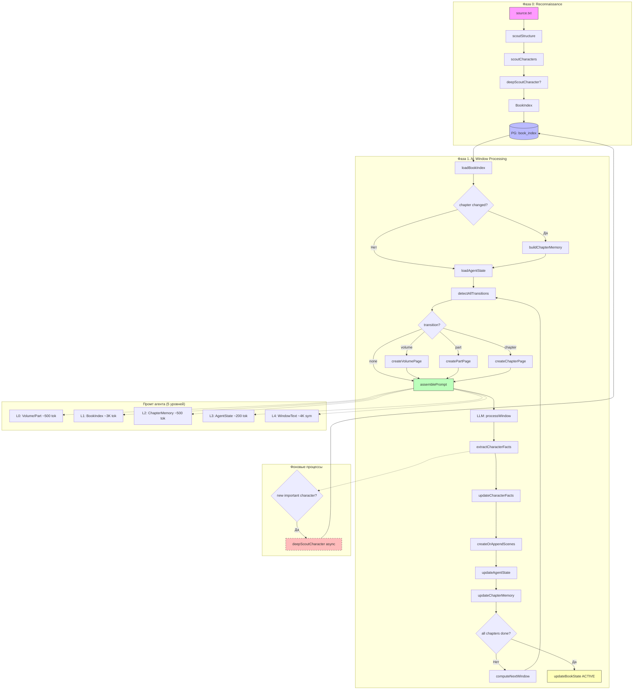

# Рефакторинг AI-агента: Stateful Agent с многоуровневой памятью

> Версия: 1.2  
> Дата: 2026-06-12  
> Статус: Черновик архитектуры (revised after review, long-term vision added)

---

## Содержание

1. [Текущие проблемы](#1-текущие-проблемы)
2. [Целевая архитектура](#2-целевая-архитектура)
3. [Многоступенчатая разведка (Reconnaissance)](#3-многоступенчатая-разведка-reconnaissance)
4. [Book Index — глобальная память](#4-book-index--глобальная-память)
5. [Chapter Memory — локальная память главы](#5-chapter-memory--локальная-память-главы)
6. [Volume/Part Memory — память крупных блоков](#6-volumepart-memory--память-крупных-блоков)
7. [Agent State — позиция и контекст сессии](#7-agent-state--позиция-и-контекст-сессии)
8. [Эволюционирующие персонажи (Accumulated Facts)](#8-эволюционирующие-персонажи-accumulated-facts)
9. [Детектирование перехода глав](#9-детектирование-перехода-глав)
10. [Схема данных (БД)](#10-схема-данных-бд)
11. [Изменения в сервисах](#11-изменения-в-сервисах)
12. [Миграция со старой системы](#12-миграция-со-старой-системы)
13. [План внедрения по этапам](#13-план-внедрения-по-этапам)
14. [Диаграмма нового пайплайна](#14-диаграмма-нового-пайплайна)
15. [Сравнение: было → стало](#15-сравнение-было--стало)
16. [Что отложено на вторую очередь](#16-что-отложено-на-вторую-очередь)
17. [Долгосрочное видение: от Book Index к World Model](#17-долгосрочное-видение-от-book-index-к-world-model)

---

## 1. Текущие проблемы

### 1.1 Агент теряет контекст между окнами

```
Окно 1 (гл.1, chars=[А,Б]) → жёсткий разрыв → Окно 2 (гл.3, chars=[В,Г])
                                                      ↑
                                              Агент не знает, что глава 2 была пропущена
```

Причина: `window_data` хранит только `remaining_scenes` и `remaining_text`, но не позицию в книге. Агент не получает ответа на вопрос «где я сейчас?»

### 1.2 Главы определяются эвристиками, а не индексом

В `getWindowText()` главы определяются по смещению (`windowIndex * MAX_WINDOW_CHARS`) и регуляркам:

```javascript
const chapterRe = /^(?:Глава|Chapter)\\s*[.:]?\\s*(.+)$/i;
```

Это ломается на нумерованных частях, вложенных структурах, нестандартных заголовках.

### 1.3 Chapter page создаётся на каждом окне

```
Глава 1 → страница главы (окно 1)
Глава 1 → страница главы (окно 2) ← дубль
```

### 1.4 Персонажи мержатся по ID без конфликт-резолюции

Если в окне 1 персонаж «высокий», а в окне 3 — «среднего роста», выигрывает окно 1 случайно.

### 1.5 Нет глобального скоупа

Агент не видит: сколько всего глав, какие персонажи уже введены, где мы находимся.

---

## 2. Целевая архитектура

### 2.1 Принципы

Архитектура строится вокруг **четырёхуровневой иерархической памяти**:

```
┌──────────────────────────────────────────────────────────────┐
│              Уровень 0: Volume/Part Memory                    │
│  (только для многотомных / многочастных произведений)         │
│  ┌──────────────┐ ┌──────────────┐ ┌──────────────┐         │
│  │ Volume 1     │ │ Volume 2     │ │ Volume 3     │         │
│  │ parts: [0-5] │ │ parts: [6-9] │ │ parts: [10]  │         │
│  └──────────────┘ └──────────────┘ └──────────────┘         │
├──────────────────────────────────────────────────────────────┤
│              Уровень 1: Book Index                            │
│  (глобальный, строится многоступенчато, ~3K токенов)         │
│  ┌──────┐ ┌──────┐ ┌──────────┐                              │
│  │главы │ │части │ │локации   │                              │
│  └──────┘ └──────┘ └──────────┘                              │
├──────────────────────────────────────────────────────────────┤
│              Уровень 2: Chapter Memory                        │
│  (кеш текущей главы, строится при входе в главу)             │
│  ┌────────────────────────────────────────────────┐          │
│  │ chapterSummary, activeCharacters,              │          │
│  │ activeLocations, activeNarrativeElements       │          │
│  └────────────────────────────────────────────────┘          │
├──────────────────────────────────────────────────────────────┤
│              Уровень 3: Agent State                           │
│  (текущая позиция, меняется с каждым окном)                  │
│  ┌────────────────────────────────────────────────┐          │
│  │ currentChapterIndex, currentTextOffset,        │          │
│  │ previousWindowSummary, chapterTransitionFlag   │          │
│  └────────────────────────────────────────────────┘          │
├──────────────────────────────────────────────────────────────┤
│              Уровень 4: Window Text                           │
│  (локальный кусок, ~4K символов)                             │
│  ┌────────────────────────────────────────────────┐          │
│  │ verbatim text chunk to process                 │          │
│  └────────────────────────────────────────────────┘          │
└──────────────────────────────────────────────────────────────┘
```

### 2.2 Пять уровней памяти

| Уровень | Что хранит | Размер в контексте | Когда строится |
|---------|-----------|-------------------|---------------|
| **L0: Volume/Part** | Тома, части, их границы | ~500 токенов | При входе в новый том/часть |
| **L1: Book Index** | Главы, персонажи, локации (глобальный реестр) | ~3K токенов | Многоступенчатая разведка (см. раздел 3) |
| **L2: Chapter Memory** | Сводка главы, активные сущности, элементы сюжета | ~500 токенов | При входе в новую главу |
| **L3: Agent State** | Позиция, предыдущее окно, флаги | ~200 токенов | Обновляется после каждого окна |
| **L4: Window Text** | Исходный текст для обработки | ~4K символов | Каждое окно |

### 2.3 Почему Chapter Memory — отдельный уровень

Chapter Memory решает проблему «агент не обязан постоянно обращаться ко всему Book Index». Когда мы внутри главы 8 из 32, модели достаточно знать:

- Сводку этой главы
- Активных в ней персонажей (не всех 50 из книги, а 3-5 для этой главы)
- Локации этой главы
- Что было в предыдущей главе

**Book Index** — это справочник («lookup table»). **Chapter Memory** — это активный контекст («working set»).

---

## 3. Многоступенчатая разведка (Reconnaissance)

### 3.1 Проблема единого Analysis Pass

Исходная идея — один большой LLM-вызов на весь текст — хорошо работает для небольших произведений (<50K слов). Для больших книг она упирается в ограничения:

- Ограничение контекстного окна LLM (даже 128K токенов может не хватить)
- Сложные структуры (тома внутри частей внутри глав)
- Персонажи, появляющиеся через 200 страниц после начала
- Стоимость: один гигантский промт может быть дороже нескольких маленьких

### 3.2 Новая схема: многоступенчатая разведка

```
                   Этап 1: РАЗВЕДКА СТРУКТУРЫ
                   ─────────────────────────────
                   Цель: тома, части, главы, prologue/epilogue
                   Метод: сканирование заголовков по всему тексту
                   (может быть несколько вызовов LLM, если книга
                   слишком длинная — каждый вызов анализирует
                   свою треть текста и извлекает заголовки)
                          │
                          ▼
                   Этап 2: РАЗВЕДКА ПЕРСОНАЖЕЙ И ЛОКАЦИЙ
                   ─────────────────────────────────────
                   Цель: глобальный реестр персонажей и локаций
                   Метод: выборочные проходы по ключевым сценам
                   (первые появления, массовые сцены, финал)
                   НЕ обязательно читать всю книгу целиком
                          │
                          ▼
                   Этап 3: АДРЕСНАЯ ДОРАЗВЕДКА
                   ────────────────────────────
                   Цель: уточнение найденных сущностей
                   Метод: если найден важный персонаж —
                   дополнительный запрос к его ключевым сценам
                          │
                          ▼
              Book Index (пополняется по мере продвижения)
```

### 3.3 Детали этапов

**Этап 1 — Разведка структуры:**

```javascript
async function scoutStructure(sourceText) {
    // 1. Разбить текст на страйды по ~50K символов с перекрытием
    const strides = createOverlappingStrides(sourceText, 50000, 5000);

    // 2. Для каждого страйда — извлечь заголовки глав
    const allHeaders = [];
    for (const stride of strides) {
        const headers = await callLLM('extract_headers', stride);
        allHeaders.push(...headers);
    }

    // 3. Склеить результаты, разрешив дубли на границах страйдов
    const chapters = mergeHeaders(allHeaders);

    // 4. Валидация: нет пересечений, порядок соблюдён
    return validateChapters(chapters);
}
```

**System prompt для Этапа 1:**

```markdown
You are a literary structure analyst. Scan the provided text segment
and identify ALL chapter/section headers and structural boundaries.

## Rules
- Identify: chapter headers, part headers, volume headers, prologue/epilogue
- Return the EXACT header line as it appears in the text
- Include the byte offset of each header within the FULL document
- Ignore decorative separators (---, ***)
- If no headers found, return empty array

## Types
- "volume" — for "Том", "Volume"
- "part" — for "Часть", "Part"
- "chapter" — for "Глава", "Chapter"
- "prologue" — for "Пролог", "Prologue"
- "epilogue" — for "Эпилог", "Epilogue"

## Output format
{ "headers": [{ "type", "text", "offset", "number" }] }

## Text to analyze
{stride_text}
```

**Этап 2 — Разведка персонажей:**

```javascript
async function scoutCharacters(sourceText, bookStructure) {
    // 1. Выбрать репрезентативные сегменты:
    //    - Первые 10% текста (первые появления)
    //    - Середина (массовые сцены)
    //    - Последние 10% (финальные появления)
    //    - Ключевые главы (по структуре из Этапа 1)
    const samples = selectStrategicSamples(sourceText, bookStructure);

    // 2. Для каждого сегмента — извлечь персонажей
    const allCharacters = [];
    for (const sample of samples) {
        const chars = await callLLM('extract_characters', sample);
        allCharacters.push(...chars);
    }

    // 3. Слить по имени (fuzzy match), устранить дубли
    return deduplicateCharacters(allCharacters);
}
```

**System prompt для Этапа 2:**

```markdown
You are a literary character analyst. Extract ALL named characters
from the provided text segment.

## Rules
- Extract every named person (first name, full name, title)
- For each character: name, role (protagonist/antagonist/supporting/minor),
  brief description, first impression of appearance
- Do NOT include objects, places, or abstract concepts
- Be inclusive — when unsure, include (the system will deduplicate later)

## Known book structure (for context)
{book_structure_summary}

## Previous characters found (for dedup)
{known_characters_summary}

## Output format
{ "characters": [{ "name", "role", "description", "appearance" }] }

## Text to analyze
{sample_text}
```

**Этап 3 — Адресная доразведка:**

Запускается, когда в Этапе 2 обнаружен персонаж, который явно важен (protagonist, antagonist), но описан слишком поверхностно. Агент выполняет дополнительный поиск по ключевым главам (из Book Index), где этот персонаж появляется.

```javascript
async function deepScoutCharacter(characterId, bookIndex, sourceText) {
    // 1. Найти главы, где персонаж появляется (первые 3+ ключевых)
    const targetChapters = findCharacterChapters(characterId, bookIndex);

    // 2. Извлечь текст этих глав из source.txt по offset
    const texts = targetChapters.map(ch =>
        sourceText.substring(ch.start_offset, ch.end_offset)
    );

    // 3. Вызвать LLM для углублённого анализа
    const details = await callLLM('deep_character_analysis', {
        character_name: characterId,
        texts
    });

    // 4. Дополнить запись персонажа
    return enhanceCharacter(characterId, details);
}
```

### 3.4 Инкрементальное пополнение индекса

Book Index не обязательно должен быть полным до начала оконной обработки. Он может **пополняться по мере продвижения**:

```javascript
// Во время обработки окна 7 обнаружился новый персонаж
const newCharacter = { id: "ivanov", name: "Иванов", ... };

// Дополнить Book Index
bookIndex.characters.push(newCharacter);

// Можно сразу запустить адресную доразведку (асинхронно)
enqueueDeepScout(newCharacter.id, bookIndex, sourceText);
```

Это особенно важно для очень длинных книг: не нужно ждать полного анализа всего текста, можно начать обрабатывать окна сразу после Этапа 1, а персонажей и локации донаполнять по ходу.

---

## 4. Book Index — глобальная память

### 4.1 Структура данных

Book Index — это **живой документ**, который может пополняться. В отличие от v1.0 архитектуры, здесь нет `narrative_threads` (отложено) и персонажи хранят накопленные факты (см. раздел 8).

```typescript
interface BookIndex {
  /** Метаданные */
  book_id: string;
  metadata: {
    title: string | null;
    author: string | null;
    language: string;
    total_chars: number;
  };

  /** Структура произведения */
  structure: {
    has_prologue: boolean;
    has_epilogue: boolean;
    volumes: Array<VolumeDescriptor>;     // только для многотомных
    parts: Array<PartDescriptor>;
  };

  /** Главы — точные границы по offset */
  chapters: Array<ChapterDescriptor>;

  /** Персонажи (глобальный реестр с накопленными фактами) */
  characters: Array<CharacterAccumulator>;  // см. раздел 8

  /** Локации (глобальный реестр) */
  locations: Array<{
    id: string;
    name: string;
    type: 'indoor' | 'outdoor' | 'abstract';
    description: string;
    chapter_presence: number[];
    accumulated_mentions: Array<{
      chapter_index: number;
      description_snippet: string;
    }>;
  }>;

  /** Версия и флаги */
  index_version: number;
  recon_stage: 'structure_only' | 'characters_done' | 'deep_scout_done';
}
```

**VolumeDescriptor** (только для многотомных):

```typescript
interface VolumeDescriptor {
  id: string;           // v-001
  title: string;        // "Том 1"
  order: number;
  part_indices: number[];  // какие части index входят в этот том
  chapter_indices: number[];
  start_offset: number;
  end_offset: number;
}
```

**PartDescriptor**:

```typescript
interface PartDescriptor {
  id: string;           // pt-001
  name: string;         // "Часть первая"
  order: number;
  chapter_indices: number[];
  volume_id: string | null;  // к какому тому относится
  start_offset: number;
  end_offset: number;
}
```

**ChapterDescriptor** (без изменений относительно v1.0, кроме удаления narrative_threads):

```typescript
interface ChapterDescriptor {
  id: string;
  index: number;
  title: string;
  header_line: string;
  type: 'prologue' | 'chapter' | 'epilogue' | 'introduction';
  start_offset: number;
  end_offset: number;
  word_count: number;
  summary: string;
  key_characters: string[];
  key_locations: string[];
  volume_id: string | null;       // привязка к тому
  part_id: string | null;         // привязка к части
  processed_chapter_pages: boolean;
  scene_count: number;
  status: 'not_processed' | 'partial' | 'complete';
}
```

### 4.2 Уровни готовности индекса

Book Index **не обязан быть полным** к началу обработки. Его готовность определяется стадией разведки:

| Стадия | Что известно | Когда достигается |
|--------|-------------|-------------------|
| `structure_only` | Главы, части, тома с offset | После Этапа 1 |
| `characters_done` | + глобальный реестр персонажей и локаций | После Этапа 2 |
| `deep_scout_done` | + углублённые описания важных персонажей | После Этапа 3 (может быть асинхронным) |

**Обработка окон может начинаться уже на стадии `structure_only`.**

---

## 5. Chapter Memory — локальная память главы

### 5.1 Зачем

Когда агент обрабатывает главу 8 из 32, ему не нужно видеть ВЕСЬ Book Index. Ему нужен компактный контекст этой главы:

- Чья это глава (номер, название, сводка)
- Кто в ней активен (3-5 персонажей)
- Где происходит действие
- Что было в предыдущей главе

Chapter Memory — это **кеш**, который строится при входе в новую главу и живёт, пока агент внутри неё.

### 5.2 Структура

```typescript
interface ChapterMemory {
  /** Идентификация */
  chapter_index: number;
  chapter_title: string;
  chapter_type: 'prologue' | 'chapter' | 'epilogue' | 'introduction';

  /** Текущее содержание */
  summary: string;
  previous_chapter_summary: string;      // что было до
  next_chapter_summary: string | null;   // что будет после (если известно)

  /** Активные сущности (только для этой главы) */
  active_characters: Array<{
    id: string;
    name: string;
    role: string;
    appearance_summary: string;     // только релевантное для визуала
    accumulated_facts: string[];    // накопленные факты о персонаже
  }>;

  active_locations: Array<{
    id: string;
    name: string;
    description: string;
  }>;

  /** Визуальный контекст */
  visual_context: {
    time_of_day: string | null;      // утро/день/вечер/ночь
    weather: string | null;
    season: string | null;
    atmosphere: string | null;
  };

  /** Локальные элементы сюжета (только для текущей главы) */
  // narrative_elements — вынесено во вторую очередь

  /** Производная информация (для модели) */
  derived_context: string;    // ~500 токенов, готовый блок для вставки в промт
}
```

### 5.3 Как строится

```javascript
async function buildChapterMemory(bookIndex, chapterIndex, sourceText) {
    const chapter = bookIndex.chapters[chapterIndex];
    const prevChapter = bookIndex.chapters[chapterIndex - 1] || null;
    const nextChapter = bookIndex.chapters[chapterIndex + 1] || null;

    return {
        chapter_index: chapter.index,
        chapter_title: chapter.title,
        chapter_type: chapter.type,
        summary: chapter.summary,
        previous_chapter_summary: prevChapter?.summary || 'Начало книги',
        next_chapter_summary: nextChapter?.summary || null,
        active_characters: chapter.key_characters.map(id => ({
            id,
            name: bookIndex.characters.find(c => c.id === id)?.name || id,
            role: bookIndex.characters.find(c => c.id === id)?.role || 'minor',
            appearance_summary: summarizeAppearance(bookIndex, id),
            accumulated_facts: bookIndex.characters.find(c => c.id === id)?.accumulated_facts || [],
        })),
        active_locations: chapter.key_locations.map(id => ({
            id,
            name: bookIndex.locations.find(l => l.id === id)?.name || id,
            description: bookIndex.locations.find(l => l.id === id)?.description || '',
        })),
        visual_context: { time_of_day: null, weather: null, season: null, atmosphere: null },
        derived_context: buildDerivedContext(chapter, bookIndex),
    };
}
```

### 5.4 Размер в промте

Chapter Memory сериализуется в ~500 токенов и вставляется между Book Index (~3K) и Agent State (~200):

```
Book Index (~3K токенов) → Chapter Memory (~500) → Agent State (~200) → Window Text (~4K)
```

---

## 6. Volume/Part Memory — память крупных блоков

### 6.1 Когда нужна

Для большинства книг достаточно Book Index + Chapter Memory. Volume/Part Memory включается только для:

- Многотомных произведений («Война и мир», 4 тома)
- Произведений с явными частями («Часть первая», «Часть вторая»)
- Книг >500K слов, где Book Index сам по себе может быть большим

### 6.2 Структура

```typescript
interface VolumeMemory {
  id: string;
  title: string;
  order: number;
  summary: string;                // сводка всего тома
  total_chapters: number;
  chapter_range: [number, number];
  key_characters: string[];      // ключевые для этого тома
  key_locations: string[];
  derived_context: string;        // ~500 токенов
}

interface PartMemory {
  id: string;
  name: string;
  order: number;
  summary: string;
  chapter_range: [number, number];
  key_characters: string[];
  volume_id: string | null;
  derived_context: string;        // ~300 токенов
}
```

### 6.3 Логика активации

```
При переходе в новую главу:
  if chapter.volume_id != currentVolume:
    loadVolumeMemory(bookIndex, chapter.volume_id)   // L0 активирован
  if chapter.part_id != currentPart:
    loadPartMemory(bookIndex, chapter.part_id)        // L0 активирован
  buildChapterMemory(bookIndex, chapter.index)        // L2 строится
```

Промт агента в этом случае:

```
# Mode: Import

## Book Index
(только метаданные + списки без деталей)

## Volume Memory
Том 1 (главы 1-12): «Москва 1920-х» — Воланд прибывает в Москву...

## Current Part
Часть первая (главы 1-12): «Пребывание Воланда»

## Chapter Memory
Глава 8: «Бой в Варьете»
Персонажи: koroviev, woland, begemot
...

## Current Position
...
```

---

## 7. Agent State — позиция и контекст сессии

### 7.1 Структура

```typescript
interface AgentState {
  /** Сессия */
  session_id: string;
  book_id: string;

  /** Иерархическая позиция */
  current_volume_id: string | null;
  current_part_id: string | null;
  current_chapter_index: number;
  current_text_offset: number;
  current_window_number: number;

  /** Контекст */
  previous_window_summary: string;
  active_window_characters: string[];
  active_window_location: string | null;

  /** Флаги */
  chapter_transition_detected: boolean;
  chapter_page_already_created: boolean;   // для этой главы
  volume_transition_detected: boolean;      // для многотомных
  part_transition_detected: boolean;        // для многочастных

  /** Статистика */
  total_scenes_created: number;
  total_windows_processed: number;
  total_chapter_pages_created: number;
  total_characters_discovered: number;
}
```

### 7.2 Как обновляется

```
ПЕРЕД окном:
  1. computeWindowOffset(windowNumber) → offset
  2. resolveVolume(offset, bookIndex) → volumeId
  3. resolvePart(offset, bookIndex) → partId
  4. resolveChapter(offset, bookIndex) → chapterIndex
  5. detectTransitions(prevState, current) → flags

ПОСЛЕ окна:
  1. SummarizeCreatedScenes() → previousWindowSummary
  2. Update character registry if new characters found
  3. Increment counters
  4. Save to PG
```

---

## 8. Эволюционирующие персонажи (Accumulated Facts)

### 8.1 Проблема статических записей

В текущей системе (и в v1.0 архитектуры) персонаж — это фиксированная запись:

```javascript
{
  id: "pierre",
  name: "Пьер Безухов",
  description: "Незаконный сын графа Безухова",
  appearance: "Крупный молодой человек в очках"
}
```

Но в литературе информация о персонаже раскрывается постепенно:
- В главе 1: «Пьер вошёл, неуклюжий, толстый, в очках»
- В главе 5: «Пьер снял очки и протёр глаза — они оказались маленькими и близорукими»
- В главе 12: «Он стоял в новом мундире, ещё более толстый и красный»

**Персонаж должен накапливать факты, а не заменять их.**

### 8.2 Новая структура: Accumulated Facts

```typescript
interface CharacterAccumulator {
  /** Стабильные поля */
  id: string;
  name: string;
  role: 'protagonist' | 'antagonist' | 'supporting' | 'minor';

  /** Динамические факты — накапливаются по мере обработки */
  accumulated_facts: Array<CharacterFact>;

  /** Производные сводки (пересчитываются при добавлении фактов) */
  current_appearance: string;     // консолидированное описание внешности
  current_traits: string[];       // консолидированные черты
  current_voice: string;

  /** Метаданные */
  first_appearance_offset: number;
  chapter_presence: number[];
  witness_chapters: Array<{
    chapter_index: number;
    facts_added: number;
  }>;
}

interface CharacterFact {
  id: string;                     // cf-xxxxxxxx
  chapter_index: number;          // в какой главе найден
  category: 'appearance' | 'personality' | 'relationship' | 'biography' | 'action';
  text: string;                   // оригинальный текст факта из книги
  source_snippet: string;         // контекст (пара предложений вокруг)
  confidence: number;             // 0.0-1.0
  superseded_by: string | null;   // id факта, который заменил этот
}
```

### 8.3 Консолидация фактов

```javascript
function consolidateCharacter(character, bookIndex) {
    // Берём все непереопределённые факты (superseded_by === null)
    const activeFacts = character.accumulated_facts.filter(f => !f.superseded_by);

    // По категориям
    const appearanceFacts = activeFacts.filter(f => f.category === 'appearance');
    const personalityFacts = activeFacts.filter(f => f.category === 'personality');

    // Строим текущее описание внешности:
    // Берём самый детальный факт (по длине) как базовый,
    // дополняем уникальными деталями из остальных
    character.current_appearance = mergeAppearances(appearanceFacts);

    // Собираем черты (без дублей)
    character.current_traits = extractTraits(personalityFacts);
}
```

### 8.4 Как используется в промте

```markdown
## Chapter Memory — Active Characters

### Пьер Безухов (protagonist)
**Текущее описание:** Крупный, толстый молодой человек в очках.
Носит новый белый мундир. Лицо красное от волнения.

**Накопленные факты:**
- [гл.1] Вошёл неуклюже, толстый, в очках
- [гл.5] Снял очки — глаза маленькие, близорукие
- [гл.12] В новом мундире, ещё более толстый и красный
- [гл.14] Начал говорить быстро, сбивчиво, размахивая руками
```

---

## 9. Детектирование перехода глав

### 9.1 Логика (выполняется в коде, НЕ модели)

```javascript
function detectAllTransitions(bookIndex, currentOffset, previousAgentState) {
    const currentVolume = bookIndex.volumes?.find(v =>
        currentOffset >= v.start_offset && currentOffset <= v.end_offset
    ) || null;
    const currentPart = bookIndex.structure.parts?.find(p =>
        currentOffset >= p.start_offset && currentOffset <= p.end_offset
    ) || null;
    const currentChapter = binarySearch(bookIndex.chapters, currentOffset,
        'start_offset');

    return {
        // Volume transition
        volume_changed: currentVolume?.id !== previousAgentState.current_volume_id,
        new_volume: currentVolume,

        // Part transition
        part_changed: currentPart?.id !== previousAgentState.current_part_id,
        new_part: currentPart,

        // Chapter transition
        chapter_changed: currentChapter?.index !== previousAgentState.current_chapter_index,
        new_chapter: currentChapter,
        create_chapter_page: currentChapter?.index !== previousAgentState.current_chapter_index
            && !currentChapter?.processed_chapter_pages,
    };
}
```

### 9.2 Страницы глав создаются только при переходе

```javascript
async function processWindow(bookId, windowNumber, bookIndex, agentState, sourceText) {
    const windowText = extractWindowText(sourceText, windowNumber);
    const transitions = detectAllTransitions(bookIndex, windowText.offset, agentState);

    // Создать страницы для новых томов/частей/глав ТОЛЬКО при переходе
    if (transitions.volume_changed && transitions.new_volume) {
        await createVolumePage(bookId, transitions.new_volume);
    }
    if (transitions.part_changed && transitions.new_part) {
        await createPartPage(bookId, transitions.new_part);
    }
    if (transitions.create_chapter_page) {
        await createChapterPage(bookId, transitions.new_chapter);
        bookIndex.chapters[transitions.new_chapter.index].processed_chapter_pages = true;
    }

    // Построить Chapter Memory (если глава сменилась)
    const chapterMemory = transitions.chapter_changed
        ? await buildChapterMemory(bookIndex, transitions.new_chapter.index, sourceText)
        : agentState.current_chapter_memory;

    // Собрать промт
    const prompt = assemblePrompt(bookIndex, chapterMemory, agentState, windowText);

    // Вызвать LLM
    const result = await callLLM('process_window', prompt);

    // Обновить Agent State
    return updateAgentState(agentState, {
        current_volume_id: transitions.new_volume?.id || agentState.current_volume_id,
        current_part_id: transitions.new_part?.id || agentState.current_part_id,
        current_chapter_index: transitions.new_chapter?.index ?? agentState.current_chapter_index,
        current_chapter_memory: chapterMemory,
        current_text_offset: windowText.offset,
        current_window_number: windowNumber,
        previous_window_summary: summarizeResult(result),
        chapter_transition_detected: transitions.chapter_changed,
        chapter_page_already_created: !transitions.create_chapter_page,
        total_scenes_created: agentState.total_scenes_created + result.scenes.length,
    });
}
```

---

## 10. Схема данных (БД)

### 10.1 Новая таблица: `book_index`

```sql
CREATE TABLE book_index (
    book_id         TEXT PRIMARY KEY,
    index_data      JSONB NOT NULL,
    version         INTEGER NOT NULL DEFAULT 1,
    recon_stage     TEXT NOT NULL DEFAULT 'structure_only'
                    CHECK (recon_stage IN ('structure_only','characters_done','deep_scout_done')),
    source_checksum TEXT,
    analysis_model  TEXT,
    total_tokens    INTEGER,
    created_at      TIMESTAMP DEFAULT NOW(),
    updated_at      TIMESTAMP DEFAULT NOW()
);

CREATE INDEX idx_book_index_recon ON book_index(recon_stage);
```

### 10.2 Изменения в `agent_sessions`

```sql
ALTER TABLE agent_sessions
    ADD COLUMN IF NOT EXISTS agent_state          JSONB,
    ADD COLUMN IF NOT EXISTS chapter_transition_log JSONB,
    ADD COLUMN IF NOT EXISTS current_chapter_index INTEGER,
    ADD COLUMN IF NOT EXISTS current_text_offset  BIGINT,
    ADD COLUMN IF NOT EXISTS current_part_id      TEXT,
    ADD COLUMN IF NOT EXISTS current_volume_id    TEXT;
```

### 10.3 Новая таблица: `chapter_pages_cache`

```sql
CREATE TABLE chapter_pages_cache (
    id              SERIAL PRIMARY KEY,
    book_id         TEXT NOT NULL,
    chapter_index   INTEGER NOT NULL,
    page_type       TEXT NOT NULL DEFAULT 'chapter'
                    CHECK (page_type IN ('chapter', 'part', 'volume')),
    created_at      TIMESTAMP DEFAULT NOW(),
    UNIQUE(book_id, chapter_index, page_type)
);
```

### 10.4 Новая таблица: `character_facts` (для эволюционирующих персонажей)

```sql
CREATE TABLE character_facts (
    fact_id         TEXT PRIMARY KEY,
    book_id         TEXT NOT NULL,
    character_id    TEXT NOT NULL,
    chapter_index   INTEGER NOT NULL,
    category        TEXT NOT NULL CHECK (category IN
                      ('appearance','personality','relationship','biography','action')),
    fact_text       TEXT NOT NULL,
    source_snippet  TEXT,
    confidence      REAL DEFAULT 1.0,
    superseded_by   TEXT REFERENCES character_facts(fact_id),
    created_at      TIMESTAMP DEFAULT NOW()
);

CREATE INDEX idx_char_facts_book ON character_facts(book_id, character_id);
CREATE INDEX idx_char_facts_chapter ON character_facts(book_id, chapter_index);
```

---

## 11. Изменения в сервисах

### 11.1 Новые сервисы (создать)

| Сервис | Файл | Назначение |
|--------|------|------------|
| `book-index-service.js` | `backend/src/services/book-index-service.js` | Многоступенчатая разведка, хранение, загрузка Book Index |
| `chapter-memory-service.js` | `backend/src/services/chapter-memory-service.js` | Построение и кеширование Chapter Memory |
| `agent-state-service.js` | `backend/src/services/agent-state-service.js` | Управление состоянием сессии |
| `chapter-detector.js` | `backend/src/services/chapter-detector.js` | Offset-резолюция, детекция переходов (главы, части, тома) |
| `character-fact-service.js` | `backend/src/services/character-fact-service.js` | Управление накопленными фактами о персонажах |
| `recon-service.js` | `backend/src/services/recon-service.js` | Оркестрация многоступенчатой разведки |

### 11.2 Изменяемые сервисы

| Сервис | Что меняется |
|--------|-------------|
| `agent-service.js` | Переписать `bootstrapWithAgent()` и `bootstrapNextWindow()` для работы с многоуровневой памятью |
| `txt-importer.js` | В `bootstrapImportedText()`: запуск `reconService.scout(bookId)` вместо `agentService.bootstrapWithAgent()` |
| `lazy-book.js` | Убрать `splitIntoChapters()` — заменён на Book Index. Оставить `lazyParseNextWindow()` как fallback |
| `context-builder.js` | Добавить `buildChapterContext()` и `buildPositionContext()` |
| `ai-service.js` | Добавить `scoutStructure()`, `scoutCharacters()`, `deepScoutCharacter()` — отдельные вызовы для этапов разведки |

### 11.3 Неизменяемые сервисы

`ai-loader.js`, `chat-engine.cjs`, `ai-routes.cjs`, `scene-orchestrator.js`, `encoding-detect.js` — не меняются.

---

## 12. Миграция со старой системы

### 12.1 Ключевой принцип: старый пайплайн НЕ удаляется

Старый пайплайн (agent-service.js с 5 шагами, lazy-book splitInto*, window-generator) остаётся **полностью работоспособным** на всём протяжении рефакторинга. Это не «переходный период», а **параллельное существование** до накопления статистики.

### 12.2 Схема миграции

```
Фаза 0: СТАРЫЙ ПАЙПЛАЙН (как есть)
────────────────────────────────
  Книги импортируются старым способом
  Ничего не меняется
  Agent-service.js, lazy-book.js — основная ветка

Фаза 1: ПАРАЛЛЕЛЬНАЯ РАБОТА
────────────────────────────────
  Новый пайплайн включается через feature flag:
    config.USE_NEW_AGENT_PIPELINE = true/false

  При импорте:
    if (USE_NEW_AGENT_PIPELINE) {
        // Новый: recon → bookIndex → chapterMemory → state → windows
        await reconService.scout(bookId);
        await newAgentPipeline.run(bookId);
    } else {
        // Старый: bootstrapWithAgent → 5 steps → windows
        await agentService.bootstrapWithAgent(bookId);
    }

  Оба пайплайна пишут результат в одинаковый формат книги.
  API-ответы идентичны.

Фаза 2: СБОР СТАТИСТИКИ
────────────────────────────────
  На каждую книгу запускаются ОБА пайплайна
  (новый — в основной поток, старый — фоном для сравнения)
  Сравниваются:
    - Количество созданных сцен
    - Количество найденных персонажей
    - Количество chapter pages (дубли vs нет)
    - Точность границ глав
    - Время выполнения
    - Стоимость (токены)
  Статистика пишется в отдельную таблицу (comparison_log)

Фаза 3: ПЕРЕКЛЮЧЕНИЕ
────────────────────────────────
  После N успешных сравнений (N = 20+ книг):
    config.USE_NEW_AGENT_PIPELINE = true (по умолчанию)
  Старый пайплайн остаётся как fallback:
    if (newPipelineFailed) → try oldPipeline()

Фаза 4: ВЫВОД ИЗ ЭКСПЛУАТАЦИИ
────────────────────────────────
  Только после 100+ успешных книг на новом пайплайне:
    - Переименовать agent-service.js → agent-service.legacy.js
    - Удалить splitIntoChapters из lazy-book.js
    - Удалить window-generator.cjs (если не нужен)
```

### 12.3 Feature flag

```javascript
// config/runtime-config.js
config.USE_NEW_AGENT_PIPELINE = process.env.USE_NEW_AGENT_PIPELINE === 'true';
config.COMPARE_PIPELINES = process.env.COMPARE_PIPELINES === 'true';  // Фаза 2
```

### 12.4 Таблица сравнения

```sql
CREATE TABLE pipeline_comparison_log (
    id              SERIAL PRIMARY KEY,
    book_id         TEXT NOT NULL,
    new_result      JSONB,
    old_result      JSONB,
    new_duration_ms INTEGER,
    old_duration_ms INTEGER,
    new_total_tokens INTEGER,
    old_total_tokens INTEGER,
    scenes_match    BOOLEAN,
    characters_match BOOLEAN,
    chapter_pages_diff INTEGER,  -- разница в количестве chapter pages
    created_at      TIMESTAMP DEFAULT NOW()
);
```

### 12.5 Обратная совместимость API

Все REST-маршруты без изменений. Переключение между пайплайнами полностью прозрачно для клиента.

---

## 13. План внедрения по этапам

### Этап 1: Подготовка (2-3 дня)

- [ ] Создать `recon-service.js` — оркестратор многоступенчатой разведки
- [ ] Создать `book-index-service.js` — построение, хранение, загрузка Book Index
- [ ] Создать `chapter-memory-service.js` — построение Chapter Memory
- [ ] Создать `agent-state-service.js` — управление состоянием сессии
- [ ] Создать `chapter-detector.js` — offset-резолюция и детекция переходов
- [ ] Создать `character-fact-service.js` — управление накопленными фактами
- [ ] Написать миграцию БД (все новые таблицы + изменения)
- [ ] Добавить feature flag `USE_NEW_AGENT_PIPELINE`

### Этап 2: Разведка структуры (2-3 дня)

- [ ] Реализовать `scoutStructure()` — сканирование заголовков с перекрывающимися страйдами
- [ ] Реализовать `scoutCharacters()` — извлечение персонажей из репрезентативных сегментов
- [ ] Реализовать `deepScoutCharacter()` — адресная доразведка важных персонажей
- [ ] Интегрировать в `txt-importer.bootstrapImportedText()`:
    - [ ] После создания draft → запуск `reconService.scout(bookId)`
    - [ ] Статус разведки сохраняется в `book_index.recon_stage`
- [ ] Если LLM недоступен → fallback: старый `bootstrapWithAgent()`

### Этап 3: Новый оконный пайплайн (4-5 дней)

- [ ] Реализовать `newAgentPipeline.run(bookId)`:
    - [ ] Загружает Book Index из БД
    - [ ] Строит Chapter Memory для первой главы
    - [ ] Инициализирует Agent State
    - [ ] Собирает 5-уровневый промт (L0-L4)
    - [ ] Передаёт модели, получает сцены+юниты+визуалы
- [ ] Реализовать цикл окон:
    - [ ] `detectAllTransitions()` перед каждым окном
    - [ ] Создание chapter/part/volume pages только при переходах
    - [ ] Обновление Chapter Memory при смене главы
    - [ ] Обновление Agent State после каждого окна
- [ ] Реализовать накопление фактов о персонажах:
    - [ ] При обработке окна новые факты пишутся в `character_facts`
    - [ ] После окна — `consolidateCharacter()` для обновления сводок
- [ ] Фоновая доразведка: при обнаружении нового важного персонажа — `deepScoutCharacter()`

### Этап 4: Параллельная работа и сбор статистики (3-5 дней, ОСНОВНОЙ ЭТАП)

- [ ] Включить `COMPARE_PIPELINES`:
    - [ ] На каждую книгу запускаются оба пайплайна
    - [ ] Результаты пишутся в `pipeline_comparison_log`
- [ ] Написать дашборд сравнения (или SQL-запросы):
    - [ ] Количество сцен совпадает?
    - [ ] Персонажи совпадают?
    - [ ] Chapter pages — разница?
    - [ ] Время/стоимость
- [ ] Исправлять расхождения:
    - [ ] Если новый пайплайн систематически хуже — искать причину
    - [ ] Если старый систематически хуже — документировать как улучшение

### Этап 5: Стабилизация (3-5 дней)

- [ ] Исправить найденные расхождения между пайплайнами
- [ ] Оптимизировать размер промтов (L0-L4)
- [ ] Добавить обработку граничных случаев:
    - [ ] Книги без явных глав
    - [ ] Книги с нестандартной структурой
    - [ ] Очень длинные части (>100K слов между заголовками)
- [ ] Тестирование на реальных книгах (10-20 произведений разного размера)

### Этап 6: Переключение (1 день, только после Этапа 4-5)

- [ ] `USE_NEW_AGENT_PIPELINE = true` по умолчанию
- [ ] Старый пайплайн — как fallback при сбоях нового
- [ ] Начать мониторинг стабильности

### Этап 7: Чистка (1 день, через месяц после Этапа 6)

- [ ] Переименовать `agent-service.js` → `agent-service.legacy.js`
- [ ] Убрать `splitIntoChapters()` из `lazy-book.js`
- [ ] Убрать `window-generator.cjs`
- [ ] Убрать флаг `USE_NEW_AGENT_PIPELINE` (только новый)

---

## 14. Диаграмма нового пайплайна



---

## 15. Сравнение: было → стало

### 15.1 Обработка окна

| Аспект | Было (старая архитектура) | Стало (новая архитектура) |
|--------|--------------------------|--------------------------|
| **Память** | Нет (каждое окно независимо) | 5 уровней (Volume → Index → Chapter → State → Text) |
| **Разведка** | Нет (шаги 1-5 на каждом окне) | Многоступенчатая (структура → персонажи → адресная) |
| **Персонажи** | Извлекаются заново, мерж по ID | Накопление фактов, консолидация |
| **Главы** | Эвристики (regex) | Точный offset lookup по индексу |
| **Переход глав** | Не детектируется | Детектируется кодом, обрабатываются все уровни (volume/part/chapter) |
| **Chapter page** | Дубли на каждом окне | Только при фактическом переходе, один раз |
| **Стоимость** | 5N вызовов (N=число окон) | 1-3 (разведка) + N (окна) |
| **Восстановление** | С последнего сохранённого окна | Точная позиция по Agent State + Index |
| **Тома/части** | Не поддерживаются | Полная поддержка иерархии |

### 15.2 Влияние на стоимость

| Метрика | Было | Стало |
|---------|------|-------|
| **Вызовов LLM на 100K слов** | 5 × 25 = 125 | 3 (разведка) + 25 (окна) = 28 |
| **Токенов на окно** | ~2K | ~8K (все уровни) |
| **Всего токенов** | ~250K | 3×100K (разведка) + 25×8K = ~500K |
| **Качество персонажей** | Частичное (локальное) | Глобальное с накоплением |
| **Chapter pages** | 25 (с дублями) | ~8 (только переходы) |

Дороже (в токенах), но качественно лучше: глобальные персонажи без дублей, точные chapter pages, консистентная структура.

### 15.3 Ключевые выигрыши

1. **Точность структуры** — главы, части, тома определяются детерминированно по индексу
2. **Консистентные персонажи** — накопление фактов, а не перезапись
3. **Без дублей** — chapter pages только при реальных переходах
4. **Масштабируемость** — многоступенчатая разведка работает для книг любого размера
5. **Восстанавливаемость** — точная позиция через Agent State
6. **Безопасность** — старый пайплайн не удаляется до накопления статистики

---

## 16. Что отложено на вторую очередь

### 16.1 Narrative Threads (сюжетные линии)

Было в v1.0 архитектуры, сознательно убрано. Причина:

- Сложность: детекция сюжетных линий требует анализа всего текста, а не только структуры
- Неопределённость: одна и та же глава может относиться к нескольким линиям
- Ценность: для импорта (разбить текст на сцены) сюжетные линии не критичны

**Когда вернуться:** после стабилизации глав, персонажей, локаций и переходов.

### 16.2 Timeline Graph (граф времени)

Детекция временных скачков, флешбеков и хронологических несоответствий — интересная, но опциональная задача.

### 16.3 Knowledge Graph (граф знаний)

Автоматическое построение связей между персонажами, локациями и событиями.

### 16.4 Scene-level Semantic Search

Для ответов на вопросы пользователя («а что было в сцене, где Воланд встретил Маргариту?») — может быть реализован через векторный поиск, когда база книг вырастет.

### 16.5 Все эти функции — НЕ блокер для новой архитектуры

Новая архитектура (многоуровневая память, многоступенчатая разведка, эволюционирующие персонажи) **не требует** этих функций. Они надстраиваются сверху, когда база стабилизируется.

---

---

## 17. Долгосрочное видение: от Book Index к World Model

> ⚠️ **Важно:** Этот раздел — не техническое задание на ближайший спринт.
> Это **архитектурный вектор развития**. Некоторые пункты могут быть
> реализованы только через несколько версий системы.
> Текущий рефакторинг (разделы 1-16) — это **Фаза 1** этого плана.

### 17.1 Главная идея

Мы постепенно перестаём рассматривать книгу как **текст**.

Мы начинаем рассматривать книгу как **мир**.

Конечная цель — не набор сцен и юнитов, а построение **внутренней модели произведения** (World Model), которая может использоваться для:

- импорта;
- визуализации;
- поиска;
- редактирования;
- общения с книгой;
- анализа персонажей;
- анализа сюжетных линий.

Книга становится **источником данных** для построения World Model.

```
Было:       Книга → Окно → LLM → Сцены
Стало:      Книга → Разведка → World Model → Сцены / Визуалы / Аналитика
Будет:      Книга → Разведка → World Model → Multi-Agent System → Всё
```

### 17.2 Долгосрочная архитектура памяти

Текущие 5 уровней памяти (L0-L4) — правильное направление, но в долгосрочной перспективе они станут частью единой модели мира:

```
┌──────────────────────────────────────────────────────────────────┐
│                WORLD MODEL (единая модель произведения)           │
│  ┌──────────┐ ┌──────────┐ ┌──────────┐ ┌──────────┐ ┌────────┐ │
│  │Structure │ │Characters│ │Locations │ │Events    │ │Timeline│ │
│  └──────────┘ └──────────┘ └──────────┘ └──────────┘ └────────┘ │
│  ┌──────────┐ ┌──────────┐ ┌──────────┐                          │
│  │Relations │ │Narrative │ │Confidence│                          │
│  │-ships    │ │Threads   │ │Layer     │                          │
│  └──────────┘ └──────────┘ └──────────┘                          │
├──────────────────────────────────────────────────────────────────┤
│  L0: Volume/Part ← L1: Book Index ← L2: Chapter ← L3: State ← L4: Window │
│              (эти уровни — runtime-проекция World Model)          │
└──────────────────────────────────────────────────────────────────┘
```

### 17.3 Book Index как живой объект

Book Index **не** должен рассматриваться как одноразовый результат анализа. Он должен постепенно развиваться:

- **Повторные разведки** — при добавлении новых данных;
- **Доразведки** — при обнаружении неизвестных сущностей;
- **Уточнения** — при появлении более точных фактов;
- **Исправление противоречий** — конфликт-резолюция между фактами;
- **Обогащение данных** — добавление новых категорий информации.

Индекс — **живой объект**, а не статический JSON.

### 17.4 Архитектура нескольких агентов

В будущем рассматриваем архитектуру **Multi-Agent System**:

| Агент | Назначение |
|-------|-----------|
| **Orchestrator Agent** | Строит общую картину мира, принимает архитектурные решения, объединяет результаты |
| **Structure Agent** | Анализирует структуру произведения (тома, части, главы) |
| **Character Agent** | Ищет и уточняет персонажей, собирает факты |
| **Location Agent** | Анализирует и каталогизирует локации |
| **Scene Agent** | Разбивает текст на сцены |
| **Visual Agent** | Создаёт промты для визуализации |
| **Continuity Agent** | Проверяет непротиворечивость (появляется на поздних этапах) |

**Orchestrator Agent** работает как **интегратор знаний**, а не как исполнитель всех задач. Текущий agent-service — это прототип Orchestrator, который пока делает всё сам.

### 17.5 Эволюция персонажей: от Static → Timeline

Персонажи не являются статическими объектами. В литературе они изменяются во времени:

- изменение внешности (старение, ранения);
- изменение социального статуса;
- изменение отношений;
- изменение характера (character arc).

Поэтому долгосрочная структура персонажа:

```
Character
├── Static Info         (id, имя, роль в книге)
├── Timeline            (хронология изменений)
│   ├── Событие 1: "Знакомство с читателем" (гл.1)
│   ├── Событие 2: "Первое серьёзное испытание" (гл.5)
│   ├── Событие 3: "Поворотный момент" (гл.12)
│   └── Событие 4: "Финальное состояние" (гл.25)
├── Facts               (накопленные факты — уже реализовано в разделе 8)
├── Appearance Timeline (внешность по главам)
└── Relationships      (связи с другими персонажами, тоже с временной привязкой)
```

#### 17.5.1 Временна́я актуальность

Для визуализации важен ответ на вопрос:

> **«Как персонаж выглядит в этой главе?»**

а не:

> **«Как выглядит персонаж вообще?»**

Любые факты должны иметь **временной контекст**:

| Глава | Внешность | Одежда | Состояние |
|-------|-----------|--------|-----------|
| 1 | Бледный, худой | Старый сюртук | Спокоен |
| 5 | Синяк под глазом | Мундир, грязный | Взволнован |
| 12 | Исхудавший, борода | Больничная рубаха | Без сознания |
| 25 | Поседевший, но бодрый | Дорогой костюм | Уверен |

### 17.6 Уровень уверенности (Confidence Layer)

Одно из важнейших направлений развития. Система должна различать:

1. **Прямой факт из книги** — `direct_evidence` (написано явно: «Он был высокого роста»)
2. **Логический вывод** — `inferred_fact` (из контекста: «Он достал книгу с верхней полки» → высокий)
3. **Гипотеза модели** — `speculative_fact` (модель предположила: «Вероятно, ему около 30 лет»)

```typescript
interface Confidence {
  level: 'direct' | 'inferred' | 'speculative';
  score: number;         // 0.0-1.0
  source: string;        // цитата или описание вывода
  source_chapter: number;
}
```

**Низкая уверенность** должна автоматически создавать задачи для дополнительной разведки:

```javascript
if (fact.confidence.score < 0.5) {
    enqueueDeepScout(fact.character_id, {
        focus: fact.category,
        hint: `Confidence too low: ${fact.source}`
    });
}
```

#### 17.6.1 Борьба с накоплением галлюцинаций

Система должна понимать разницу между:

> «Это написано в книге»

и

> «Это предположила модель»

Нельзя позволять гипотезам со временем превращаться в факты. Текущая архитектура уже закладывает это через `confidence` в `CharacterFact`. В будущем:

- `direct_evidence` — не может быть отменено гипотезой;
- `inferred_fact` — может быть уточнён новым `direct_evidence`;
- `speculative_fact` — автоматически помечается на проверку при появлении новых данных.

### 17.7 World Model как конечная цель

```
World Model (долгосрочная цель)
├── Structure Layer
│   ├── Volumes
│   ├── Parts
│   ├── Chapters
│   ├── Prologue / Epilogue
│   └── Structural boundaries
├── Character Layer
│   ├── Global registry
│   ├── Appearances
│   ├── Timeline (изменения во времени)
│   ├── Relationships
│   └── Arcs (эволюция характера)
├── Location Layer
│   ├── Named locations
│   ├── Spatial relationships
│   └── Chapter presence
├── Event Layer
│   ├── Major events
│   ├── Causal chains
│   ├── Narrative threads
│   └── Story arcs
├── Confidence Layer
│   ├── Evidence grading
│   ├── Contradiction detection
│   └── Auto-generated verification tasks
└── Narrative Knowledge
    ├── Thematic elements
    ├── Symbolism
    ├── Motifs
    └── Stylistic analysis
```

**Но** — это направление будущего развития, а не задача текущего рефакторинга.

### 17.8 Приоритеты

**Сейчас (Фаза 1 — ближайший спринт):**

1. Исправить потерю контекста между окнами.
2. Внедрить Book Index (многоступенчатая разведка).
3. Внедрить Chapter Memory.
4. Внедрить Agent State.
5. Эволюционирующие персонажи (Accumulated Facts).
6. Убрать дублирование страниц глав.
7. Сделать стабильное определение положения в книге.

**Потом (Фаза 2+ — следующие версии):**

- Character Timelines;
- World Model;
- Multi-Agent Architecture;
- Confidence Layer;
- Knowledge Graph;
- Event Layer / Narrative Threads.

> **Сначала — надёжность и воспроизводимость.**
> **Потом — интеллектуальность системы.**

### 17.9 Как это выглядит в архитектурном документе

```
Документ ai-agent-refactoring.md
│
├── Разделы 1-16: Фаза 1 — Book Index + многоуровневая память
│   (можно и нужно реализовывать сейчас)
│
├── Раздел 17: Долгосрочное видение — World Model
│   (не техническое задание, а архитектурный вектор)
│   ├── 17.1-17.2: Общая идея
│   ├── 17.3: Book Index как живой объект
│   ├── 17.4-17.5: Multi-Agent + Character Timeline
│   ├── 17.6: Confidence Layer
│   ├── 17.7: World Model
│   └── 17.8-17.9: Приоритеты и контекст
│
└── Каждый этап Фазы 1 должен учитывать вектор развития
    (не строить тупиковых решений, несовместимых с World Model)
```

### 17.10 Принцип архитектурной совместимости

Все решения в Фазе 1 должны проверяться на совместимость с долгосрочным видением:

| Решение в Фазе 1 | Совместимо с World Model? | Комментарий |
|-----------------|-------------------------|-------------|
| Book Index в JSONB | ✅ Да | World Model может надстраиваться поверх |
| Accumulated Facts | ✅ Да | Это основа Character Timeline |
| 5 уровней памяти | ✅ Да | L0-L4 — runtime-проекция World Model |
| Многоступенчатая разведка | ✅ Да | Эта же архитектура для Multi-Agent |
| Narrative threads → отложено | ✅ Да | Появится как Event Layer позже |
| Static chapter pages | ⚠️ Уже убрано | Заменено на chapter_transition_detected |
| Единый agent-service | ⚠️ Временно | Будет разделён на агентов в Фазе 2 |

---

## Приложение A: Пример промта окна (новая архитектура)

```
# Mode: Import

## Book Index
Book: "Война и мир" (4 тома, 15 частей, 361 глава, ~580K слов)
Текущий том: Том 1 (главы 1-56)
Текущая часть: Часть 3 (главы 16-25)

## Chapter Memory
Глава 8 из 25 (Часть 3, Том 1): "Первый бал Наташи Ростовой"
Сводка: Наташа Ростова впервые на большом балу. Она взволнована, никто
  не приглашает её танцевать. Пьер Безухов приводит Андрея Болконского.

Персонажи главы:
  - Наташа Ростова (protagonist): 17 лет, тонкая, темноглазая,
    с большим ртом. В белом бальном платье с розовой лентой.
    Факты: [гл.1] живая, подвижная; [гл.5] мечтательная
  - Пьер Безухов (supporting): толстый, в очках, в белом жилете
  - Андрей Болконский (protagonist): красивый, усталый, в полковничьем мундире

Предыдущая глава: "Пьер в гостях у Элен" — Пьер обедает у Курагиных,
  Элен флиртует с ним.

## Current Position
- Том: 1 из 4
- Часть: 3 из 15
- Глава: 8 из 361
- Предыдущее окно: "Наташа одевается к балу, графиня даёт ей последние наставления"
- **Chapter intro page создана для главы 8**

## Window Text to Process
<текст окна, ~4000 символов>

## Instructions
1. Разбей текст на сцены (компактные эпизоды с одним местом/временем)
2. Для каждой сцены: текст verbatim + участники + юниты
3. Для каждого юнита: verbatim текст + visual prompt (5-15 слов, English)
4. Используй Chapter Memory для привязки персонажей — не создавай новых
5. Новые факты о персонажах (внешность, действия, характер) — отмечай,
   они будут автоматически добавлены в character_facts
```

## Приложение B: Ключевые решения и их обоснование

| Решение | Альтернатива | Почему выбрано это |
|---------|-------------|-------------------|
| **Многоступенчатая разведка** вместо одного прохода | Один LLM-вызов на весь текст | Работает для книг любого размера. Каждый этап решает свою задачу. Возможность инкрементального пополнения |
| **Структурированный Index** вместо RAG | Векторный поиск по чанкам | Offset-based lookup детерминирован. Книжная структура (главы, части) не требует семантического поиска |
| **Chapter Memory** как отдельный уровень | Только Index + State | Агент не таскает весь Index в каждый запрос. Рабочий набор сущностей для текущей главы компактен |
| **Volume/Part Memory** опционально | Всегда включать | Для 90% книг не нужно. Включается только для многотомных |
| **Эволюционирующие персонажи** | Статический реестр | Персонажи в литературе раскрываются постепенно. Накопление фактов точнее, чем перезапись |
| **Narrative threads — вторая очередь** | Сразу реализовать | Сложно, не критично для импорта. Не блокирует запуск новой архитектуры |
| **Старый пайплайн не удаляется** | Жёсткая миграция | Безопасность: новый пайплайн сравнивается со старым на реальных книгах. Откат в любой момент |
| **JSONB для Index** | Нормализованные таблицы | Index читается целиком в каждом окне. JSONB эффективнее при full-read |
