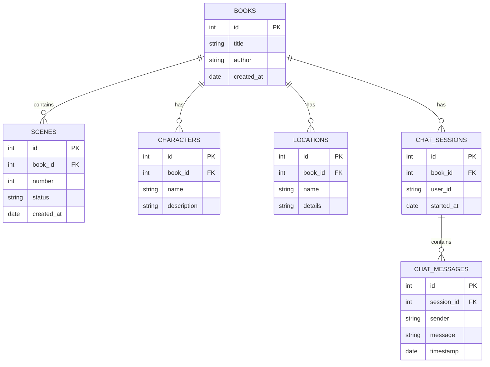
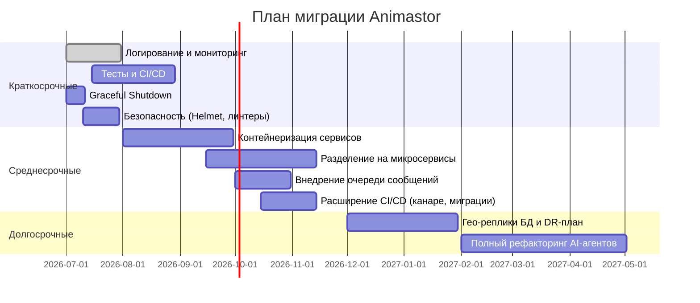

 # Исполнительное резюме

Анализ архитектуры проекта DeepSeek v4 (Animastor) выявил серьёзные риски и узкие места. Система реализована как монолит на Node.js/Express с **30+ сервисами** в одном процессе, что осложняет масштабирование и ускоряет накопление техдолга. Основные критические проблемы: жёсткие зависимости (нет абстракций для коннекторов к AI-сервисам, БД, Redis), циклические связи между модулями, микси бизнес-логики с runtime (dispatch-engine), отсутствие unit-тестов и CI/CD. Задачи генерируются централизованно через **GPU Hub** – узел-единую-точку-отказа; менеджмент процессов базируется на ручных подходах. Отсутствуют мониторинг, метрики, централизованное логирование и адекватное управление конфигурациями.

Требуются приоритетные улучшения: **краткосрочные** – добавить логирование и метрики (Prometheus/Grafana), обработку сигналов остановки и graceful-shutdown, настроить CI с тестами, внешние конфиги; **среднесрочные** – контейнеризировать сервисы (Docker/Kubernetes), настроить масштабирование фронтендов и бэкендов, ввести CI/CD пайплайн; **долгосрочные** – разделить монолит на самостоятельные сервисы (микросервисы/модули) с независимыми деплоями, внедрить отказоустойчивую архитектуру с избыточностью и политиками аварийного восстановления. 

Оптимизация должна опираться на лучшие практики (разделение по компонентам, 3-tier архитектура, stateless-сервисы), рекомендации OWASP/Node.js (надёжные HTTP-заголовки, защита от SQL-инъекций, обновление зависимостей), а также принципы обеспечения надёжности (Redundancy и Failover). Также целесообразно рассмотреть альтернативные технологии (таблица ниже) – например, очереди сообщений (Redis vs RabbitMQ/Kafka), оркестрацию нагрузочных задач (Celery/Redis vs встроенный Node-кластер), хранение файлов (локальные системы vs S3), и выбор LLM/ИИ-провайдеров. Общий план миграции приведён на диаграмме временной шкалы (ниже).  

# Обзор компонентов и их взаимодействий

Система **Animastor (DeepSeek v4)** состоит из нескольких ключевых компонентов:

- **Backend (Node.js/Express)** – единственная кодовая база (backend/src), инициализирующая Express-сервер, соединения с PostgreSQL и Redis, подключение контейнера зависимостей и регистрацию маршрутов. Отвечает на HTTP-запросы, запускает задачи генерации, обрабатывает сигналы ОС. Код сильно монолитный без чёткой границы слоёв.

- **API-слой (REST Routes)** – набор Express-маршрутов (книги, сцены, чат и др.), который реализует CRUD-операции по слоям бизнес-логики. Каждый маршрут часто перегружен ответственностью (например, book-routes обрабатывает множество логики). Отсутствует версияция API (чем грозит несовместимость при изменениях).

- **Оркестратор (Dispatch Engine, Scene Orchestrator, Task Scheduler)** – набор сервисов, реализующих выполнение генерационных задач. Компонент *dispatch-engine* создаёт «леди» (lease) в Redis, запуская процессы на GPU. *Scene-orchestrator* управляет генерацией сцен по книге. *GPU Hub* – специальный модуль, получающий задачи от бекенда и распределяющий их между воркерами. GPU Hub сейчас – единая точка обработки задач (SPOF).

- **Workers (GPU)** – процессы (возможно, Docker-контейнеры или приложения), которые выполняют тяжелые задачи генерации: **TTS, Стабильное Дифузион** (через ComfyUI), **LTX-видео**. Используют ComfyUI Workflow для генерации изображений/видео. Генерированные файлы (аудио/изображения/видео) сохраняются на файловой системе.

- **AI/LLM-сервисы** – отдельный сервис **ai-service.js**, вызывающий OpenRouter API для LLM (Qwen, Gemini, Claude и др.) и генерации текстовых подсказок. **Master Agent** выполняет последовательные шаги анализа книги (6-шаговый агент: парсинг структуры, персонажей, сюжетных арок и т.д.), обрабатывая один «agent_session» последовательно внутри монолита. Выбор моделей и промптов жёстко зашит в коде (например, `OPENROUTER_MODEL`=gemini3 или qwen), что затрудняет замену провайдеров.

- **PostgreSQL** – реляционная БД, хранящая каноничное состояние (книги, сцены, персонажи, локации, чаты, события и др.). Схема включает ~15 таблиц (books, scenes, scenes_assets, characters, locations, chat_sessions, chat_messages и др.). Сервис доступа к БД написан самостоятельно (без ORM) в `backend/src/storage/postgres`. В таблице scenes хранится статус генерации, а таблицы связей (например, scenes_assets) связывают сцены с созданными мультимедиа.

- **Redis** – используется для *runtime state*: механизмы лизинга (lease) генераторных задач, очередь задач GPU, кэш промптов, временное хранение активных сцен, heartbeat воркеров. Redis не задействован для персистентных данных. Существуют списки/измерения, из которых бэкенд дизпатчит задачи воркерам.

- **Файловая система** – хранилище медиа-файлов (JSON-книги, аудио, изображения, видео). Может быть локальной или сетевой. Большие медиа-объекты не загружаются в БД.

- **Knowledge Base (База знаний AI)** – коллекция Markdown/JSON с шаблонами подсказок (prompts), описаниями ролей, сценариев. Поддерживается отдельным конфигом. Система достаёт шаблоны для prompt engineering.

- **Фронтенд (Android)** – мобильное приложение, предоставляющее UI для чтения/просмотра сгенерированного контента и навигации по главам/сценам. Запросы идут к API бекенда.

- **CI/CD (не реализован)** – на текущий момент отсутствует формализованный CI-пайплайн. Рекомендуется ввести систему сборки (Jenkins/GitLab/GitHub Actions), включающую сбор образов, тестирование и деплой.

Каждый компонент взаимодействует через четко определённые интерфейсы (REST, очереди, БД). Однако прямые вызовы (HTTP/SQL) без абстракций усложняют тестирование и замену технологий. Компоненты неразделимые, что препятствует независимому масштабированию. Диаграмма ниже иллюстрирует общий поток данных.

```mermaid
flowchart LR
    TXT-Import[Импорт\nкниги/текста] --> Orchestrator[Оркестратор\nсцен]
    Orchestrator --> Agents[AI-агенты]
    Agents --> PostgreSQL[PostgreSQL\n(Books/Scenes/...)]
    Agents --> Orchestrator
    Orchestrator --> Dispatch[Диспетчер GPU]
    Dispatch --> GPUHub[GPU Hub] 
    GPUHub --> Workers[Workers (GPU)]
    Workers --> Storage[Хранилище файлов]
    Storage --> UserApp[Приложение]
    UserApp --> PostgreSQL
```

# Диагностика проблем и уязвимостей

**Архитектурные риски:** монолитная Node.js система. Как отмечает Atlassian, монолит сложно масштабировать: «невозможно масштабировать отдельные компоненты, сбой в одном модуле может повлиять на весь сервис». В Animastor все шаги обработки книги выполняются в одном процессе: для небольших нагрузок это пока не проблемы, но при росте нагрузки нарушение модульности усложнит развитие. Отсутствие абстракций коннекторов означает жёсткую привязку к используемым сервисам (OpenRouter, ComfyUI, PostgreSQL) – их замену придётся вносить во все сервисы вручную. Зависимость backend ↔ task-handler вызывает циклические зависимости, что может приводить к непредсказуемости. Лишняя ответсвенность классов (`book-routes`, `scene-orchestrator` и т.д.) нарушает принцип единой ответственности.

**Отказоустойчивость:** GPU Hub и Master Agent – единичные сервисы и являются **SPoF** (Single Point of Failure). По словам TierPoint, «при наличии единой точки отказа выход из строя этой части ведёт к сбою всей системы». GPU Hub, если упадёт, остановит весь конвейер генерации. Отсутствие резервирования (множество независимых экземпляров) и отсутствие автоматического failover повышают риск простоя. Аналогично, Master Agent выполнен монолитно и при ошибке теряет прогресс всей сессии.

**Производительность:** Node.js однопоточный: не задействованы все ядра ЦП (без кластеризации или контейнеров). В лучшем случае масштабирование обеспечивается запуском нескольких инстансов, но в текущей реализации нет оракула (типа Kubernetes или PM2), автоматически дублирующего процессы. Современные рекомендации: «Node.js по умолчанию использует одно ядро, необходимо реплицировать процессы, чтобы загрузить все CPU». Сбой или утечка памяти в одном инстансе может снизить общую пропускную способность, если не подняты новые.

**Масштабируемость:** Имеющаяся схема (монолит + один Redis) не позволяет горизонтально расширять только загруженные части. Например, если увеличится запрос на генерацию видео, нужно масштабировать весь бекенд, а не только GPU компоненты. Нет разделения по доменам или стейтлес сервисов. Отсутствие версииции API мешает эволюции без нарушения совместимости. Внутри AI-агентов шаги выполняются строго последовательно (что задано архитектурной логикой), но даже так некоторые операции (парсинг, генерация) можно проводить параллельно в рамках одной сцены – текущее жёсткое последовательное исполнение снижает эффективность CPU.

**Надёжность и ошибки:** Отсутствует корректная обработка сигналов остановки и graceful-shutdown. При перезапуске контейнера (обычная ситуация в Docker/K8s) текущие запросы могут прерваться, а соединения не закроются корректно, что приведёт к потере транзакций и зависшим клиентам. Node.js best practice рекомендует «обрабатывать SIGTERM и чистить соединения, отвечая на текущие запросы». Также в коде не обнаружено catch-обработчиков для большинства асинхронных ошибок – при неотловленной ошибке процесс аварийно выходит без логов.

**Метрики и мониторинг:** Их нет. Отсутствие метрик (CPU/RAM, RPS, latency, ошибки, размеры очередей GPU, GPU-использование) лишает команды возможности предварительно обнаружить проблемы. Консольных логов недостаточно – нужно централизованное логирование (Splunk/ELK) и метрики. Без этого невозможно настроить оповещения и реакцию на ухудшение работы.

**Тестирование и качество кода:** Нет покрывающих unit-тестов, нет статического анализа. Red Hat рекомендует при каждом пуше запускать набор тестов и проверку качества кода. Отсутствие тестов повышает риск дефектов в критичных модулях (AI-агент, диспетчер задач, роуты) и усложняет рефакторинг.

**Безопасность:** На текущий момент не реализованы многие best practices: отсутствуют анти-CSRF-токены, не используются Helmet для HTTP-заголовков (HSTS, CSP), запросы к БД строятся вручную без ORM/параметров (риск SQL-инъекций). Одна большая БД на всех (Postgres) – при инъекции SQL хакер может получить доступ ко всему. Секреты (токены, пароли) хранятся в переменных окружения, но не видно использования vault/шифрования (Node best рекомендует **никаких** секретов в коде или в фикседных файлах). Более того, зависимости могут быть уязвимы (нет npm audit/snyk). Приложение избыточно доверяет входным данным от AI-сервисов, а также не лимитирует допустимую нагрузку (нет rate-limiting/anti-DDOS).

# Рекомендации

Ниже представлены технические рекомендации по улучшению архитектуры и процессов. Приоритеты: К–краткосрочные, С–среднесрочные, Д–долгосрочные.

- **Архитектурное разделение:** Постепенно выделять независимые компоненты («микросервисы» или автономные модули) по бизнес-функциям (Agents, Orchestrator, GPU Hub, API-слой). Согласно Node.js best practices, следует структурировать приложение по доменам (bounded contexts). Например, AgentService (LLM-анализ) можно вынести в отдельный сервис, GPU Dispatcher – в другой, оставив Frontend/API слой легковесным. Поощряется 3-tier архитектура: отделить контроллеры (Express), доменную логику (сервисы) и слой доступа к данным. Это повысит модульность и облегчит тестирование.

- **Контейнеризация и оркестрация (С):** Упаковать сервисы в Docker-контейнеры и использовать Kubernetes (или аналоги) для управления масштабированием и отказоустойчивостью. Контейнеры должны быть stateless: не хранить сессии в памяти, а все состояния (кроме каноничных в БД/Redis) делать через внешние хранилища. Рекомендуется multi-stage Dockerfile, легковесные образы (Alpine), явные теги вместо `latest` и лимиты на память (`docker run --memory`, `--max-old-space`). Graceful shutdown: ловить SIGTERM и завершать соединения перед остановкой. Задействовать liveness/readiness пробы. Рекомендуем отказ от PM2 в продакшене, вместо этого полагаться на Kubernetes (или systemd при bare-metal) для перезапуска падений. 

- **CI/CD (С):** Организовать непрерывную интеграцию: при любом пуше запускать автоматические сборку, тесты, анализ безопасности. Пайплайн должен включать **unit/интеграционные тесты** всех критических модулей, проверку стиля кода, статический анализ (ESLint, SonarQube). После тестов – сборка Docker-образов и деплой на staging/production. Всё это можно настроить в Jenkins/GitLab CI/GitHub Actions. Важно использовать `npm ci` для гарантированного воспроизводимого установки зависимостей. Настроить политики отката (rollbacks) при неудачных релизах. 

- **Мониторинг и метрики (К–С):** Ввести систему наблюдаемости. Например, **Prometheus+Grafana**: экспортировать системные (CPU, память, диск), Node.js метрики (event loop lag, GC pauses) и бизнес-метрики (RPS, latency HTTP, error rate) через `/metrics` endpoint. По рекомендациям best-practices, отслеживать uptime, пользовательские показатели и внутренние метрики. Логи переводить в JSON и отправлять на ELK/Graylog/Splunk (Node.js либы: Winston, Pino). Использовать stdout/stderr по контейнерному принципу. Настроить алерты: CPU>80%, свободная RAM<20%, очередь задач Redis > N, доля ошибок 5% за 5 мин. Соберите дэшборды для N иментов (Latencies p95, RPS, queue backlog, GPU load).

- **Логирование (К):** Перейти на централизованное логирование: выводить логи в stdout и системный сборщик, а не в файлы. Как рекомендуют, «log destinations should not be hard-coded… логировать в stdout, а среда (contaner/узел) перенаправит в нужный агрегатор». Структурировать логи (JSON) с уникальным request_id/agent_session_id для трассировки. Добавить запросы (HTTP, DB) в журналы ошибок. Уровень логов DEBUG/TODO можно включать по конфигу. Не логировать секреты.

- **Тестирование (К):** Покрыть код юнит- и интеграционными тестами (Jest/Mocha для JS). Тестировать контроллеры и логику агентов, включая mock’и внешних сервисов (OpenRouter, ComfyUI). Ввести smoke-тесты (API-check) и end-to-end тесты критичных сценариев. Настроить статический анализ (TypeScript или ESLint + TypeScript, чтобы найти неопределенные типы и структурные ошибки заранее).

- **Резервное копирование (К-С):** Организовать backup БД и файлов. PostgreSQL – регулярные дампы (pg_dump + WAL-архивы) или использовать managed-решения с Point-in-Time Recovery. Файловая система – синхронизация на другой сервер или cloud-хранилище. TierPoint подчёркивает, что «все критичные компоненты должны иметь бэкапы». Проверять restore procedure (RTO/RPO политики).

- **Безопасность (К-С):** Ввести следующие меры:  
  - Использовать HTTPS/TLS на всех соединениях (в т.ч. внутренние вызовы).  
  - Применить Helmet.js в Express для безопасных заголовков (HSTS, XSS-Protection и др.). Настроить CSP по содержимому.  
  - Валидировать ввод: на уровне API-параметров и JSON-схем. Использовать ORM или parameterized queries (например, Sequelize, Knex) для работы с БД, чтобы предотвратить SQL-инъекции.  
  - Отдельно авторизация/аутентификация: если есть доступные эндпоинты, убедиться, что они защищены. Настроить лимиты частоты запросов (express-rate-limit или внешним балансировщиком).  
  - Управление секретами: не хранить пароли/API-ключи в коде. Рекомендовано использовать Vault или K8s Secrets, хранить лишь ссылки/переменные среды. Регулярно сканировать зависимости (`npm audit`/Snyk) на уязвимости.  
  - Запускать Node.js от непривилегированного пользователя (не root).  
  - При сборке Docker-образов удалять все временные секреты и проверять образы сканерами на уязвимости.

- **Управление конфигурацией:** Все константы окружения (строки подключения, ключи, режимы) выносить во внешние переменные/конфиг. Как рекомендует Node.js reference architecture, «конфигурацию следует выносить из кода». Временное решение – dotenv + окружение, а в будущем – централизованный конфиг-сервис (Consul, etcd).

- **Масштабирование:** Логически горизонтально масштабировать все stateless-сервисы (API и воркеры). Рекомендовано реализовать ***балансировку нагрузки*** (Nginx/Ingress) для нескольких инстансов API. GPU-воркеров также можно клонировать (несколько GPU-машин) и распределять очередь. Redis/RabbitMQ (см. альтернативы ниже) кластеризовать для отказоустойчивости. PostgreSQL масштабируется через реплики на чтение; если нагрузка огромна – рассмотреть шардирование или NoSQL (например, DynamoDB) для менее критичных данных, но пока без этого обойтись. Следует также профилировать узкие места – измерять время генерации TTS/изображения/видео и по возможности распараллеливать шаги (используя несколько промптов или дочерних агентов).



# План миграции и оценка рисков

1. **Краткосрочные (1–2 месяца)**:  
   - *Мониторинг и логирование*: внедрить Prometheus/Grafana, подключить ключевые метрики (CPU, память, latency, RPS, очередь задач). Конфигурировать алерты. Использовать ELK/Graylog для логов. **Риск:** низкий (работы в основном не затрагивают логику), эффект – быстрый рост наблюдаемости.  
   - *Обработка остановки*: реализовать правильный graceful-shutdown (ловить SIGTERM) в Node-сервере и воркерах.  
   - *Тесты и CI*: настроить систему сборки, юнит-тесты ключевых компонентов (backend роуты, агент, GPU-диспетчер). Использовать GitHub Actions/Jenkins. **Риск:** средний (требует написания тестов, возможны сбои при интеграции).  
   - *Безопасность*: установить Helmet.js и CSRF-защиту, линтер безопасности. Сканирование зависимостей. Ввести rotation ключей (OpenRouter, БД).  

2. **Среднесрочные (3–6 месяцев)**:  
   - *Контейнеризация*: упаковать бекенд и воркеры в Docker. Написать Dockerfile с учётом multi-stage (убрать dev-зависимости). Запустить в K8s или Docker Swarm, создать ReplicaSet для API и воркеров. Установить лимиты ресурсов в манифестах (CPU, memory). **Риск:** средний (налаживание сетевых взаимодействий, может потребоваться рефакторинг кода).  
   - *Микросервисы*: постепенно выделять сервисы. Например, AgentService выделить как отдельный контейнер с REST API, GPUHub – другой, BFF/API – третий. Перейти на межсервисную авторизацию (token). Это снизит coupling и повысит гибкость. **Риск:** высок (корневые рефакторинги, возможны регресси – требует тщательного тестирования).  
   - *Очередь сообщений*: рассмотреть переход с “ручного” Redis-списка к полнофункциональной очереди (BullMQ для Redis или RabbitMQ/Kafka). В таблице ниже сравнение.  
   - *CI/CD и деплой*: развёртывание «dev→stage→prod» с Canary/Blue-Green. Автоматизировать миграцию БД (Flyway/TypeORM migrations). **Риск:** средний (настройка окружений).

3. **Долгосрочные (6–12 месяцев)**:  
   - *Отказоустойчивость и резерв*: добавить geo-replica БД, организовать резервные дата-центры (где требуется). Разработать DR-план и проводить учения восстановления. **Риск:** низкий (подлежит планированию ресурсов).  
   - *Полный рефакторинг AI-агентов*: при необходимости, отделить подготовку промптов от основного сервиса, ввести «актуализацию» знаний (fine-tuning моделей) или гибридные подходы (интеграция новых NLP-библиотек).  
   - *Технологические альтернативы*: оценить переход на новые версии AI (встроенные модели, собственные), рассмотреть GraphQL вместо REST (если нужно оптимизировать загрузку данных).  



# Сравнение альтернативных решений

Для ключевых компонентов и технологий рассмотрим варианты по критериям: стоимость, сложность внедрения, совместимость, производительность.

| Компонент             | Текущее решение         | Альтернатива                             | Стоимость*   | Сложность     | Совместимость | Производительность           |
|-----------------------|------------------------|------------------------------------------|-------------|---------------|---------------|-----------------------------|
| **Очередь задач**     | Redis (список, Bull)   | RabbitMQ (AMQP)                          | Низкая/средняя (есть free) | Средняя (настройка кластера) | Хорошая (Node/JS бибиотеки) | Надежная, чуть медленнее    |
|                       |                        | Apache Kafka                             | Средняя (операционные затраты) | Высокая (эксплуатация, черезум) | Требует адаптации flow   | Очень высокая пропускная    |
| **БД**                | PostgreSQL             | MySQL                                   | Низкая/минимально (open-source) | Средняя       | Полная совместимость SQL | Сопоставимо (PG часто быстрее запросов) |
|                       |                        | MongoDB (NoSQL)                          | Низкая/средняя                | Высокая (переписывание)  | Ограниченная (SQL→NoSQL) | Высокая для чтения, гибкая схема |
| **AI/LLM API**        | OpenRouter (прокси)    | Direct API (OpenAI, etc.)               | Средняя (оплата провайдеру) | Низкая (если SDK)       | Да         | Зависит от модели            |
|                       |                        | Локальная модель (LLaMA, Mistral)       | Низкая (без отдачи на API)   | Средняя (деплой, обновление) | Да (через API/SDK) | Меньше латентность, +конфиденц. |
| **Генерация изображений** | ComfyUI (на GPU)       | HuggingFace API StableDiffusion         | Платный/бесплатный tiers     | Низкая (REST API)        | Отлично (JSON)  | Зависит от тарифов API       |
|                       |                        | Stable Diffusion on-premise (Diffusers) | Низкая (open-source)        | Средняя (GPU, окружение) | Средняя (менее автоматизирован) | Высокая, гибкость контроллера |
| **CI/CD**             | Нет                    | GitHub Actions / GitLab CI              | Низкая (есть free-аккаунты) | Средняя (настройка скриптов) | Полная    | Автоматизация ускоряет релизы |
|                       |                        | Jenkins + Kubernetes                   | Средняя/высокая (HW для Jenkins) | Высокая       | Хорошая   | Зависит от конвейера         |
| **Мониторинг**        | Локально (none)        | Prometheus + Grafana                   | Низкая (open-source)         | Средняя (установить, поддерживать) | Да       | Широкие возможности анализа  |
|                       |                        | SaaS (Datadog, New Relic)              | Высокая (оплата по инстансам) | Низкая (quickstart) | Да      | Полный стек (+Alerting)      |

*Примерная оценка (публичные open-source vs коммерческие). Детали внедрения зависят от инфраструктуры. 

В целом, Redis подходит для простых очередей и задач средней нагрузки, RabbitMQ – для надёжных распределённых очередей с сложным маршрутизациями, Kafka – для сверхвысокой нагрузки и стриминга. PostgreSQL остаётся хорошим выбором для транзакционных данных; NoSQL следует рассматривать при требовании гибкости схемы и масштабируемости. Для LLM можно сначала остаться на OpenRouter (унифицирует несколько провайдеров), а затем экспериментировать с локальными моделями (Mistral/Claude3) для снижения задержки и стоимости.

# Приоритетные метрики и правила алёртов

Основные метрики мониторинга:

- **Системные:** загрузка CPU (avg), свободная RAM, I/O диска/сети.  
- **Процессные Node.js:** *event loop lag*, использование heap памяти, кол-во открытых соединений.  
- **HTTP-сервис:** RPS (число запросов/сек), P50/P95 задержки запросов, % ошибок (4xx,5xx).  
- **Redis:** длина очередей задач, latency операций.  
- **GPU/Workers:** заполненность очереди задач, время генерации на задачу, загрузка GPU (utilization), свободная VRAM.  
- **База данных:** время выполнения запросов (P95), количество активных подключений, рост объёма БД.  
- **AI-сервис:** время отклика LLM, число обращений к OpenRouter, использование токенов.  

Например, можно в Prometheus настроить такие правила: **CPU** > 80% (5 мин) ⇒ *alert*; **падение HTTP-ответа 200** ниже 90% (5 мин) ⇒ *alert*; **длина очереди GPU** > 50 задач (1 мин) ⇒ *alert*; **event loop lag** > 200ms (1 мин) ⇒ *alert*; **использование памяти** > 90% (1 мин) ⇒ *alert*.  

Шаблоны алёртов могут быть оформлены как Prometheus Alertmanager правила. Например:  

```yaml
- alert: HighErrorRate
  expr: job:request_errors:rate5m{job="backend"} > 0.05
  for: 5m
  labels:
    severity: critical
  annotations:
    summary: "Высокий процент ошибок на API (>5%)"
    description: "Error rate = {{ $value }} (>5%). Возможно, сбои в эндпоинтах backend."

- alert: CPULoadHigh
  expr: node_cpu_seconds_total{mode!="idle"} / ignoring(mode) node_cpu_seconds_total > 0.8
  for: 2m
  severity: warning

- alert: GPUQueueBacklog
  expr: redis_list_length{queue="gpu_tasks"} > 50
  for: 1m
  severity: warning

- alert: DiskSpaceLow
  expr: (node_filesystem_avail_bytes{mountpoint="/",fstype!=""} / node_filesystem_size_bytes{mountpoint="/",fstype!=""}) < 0.15
  for: 5m
  severity: critical
```

Эти метрики и алёрты позволят своевременно реагировать на ухудшение производительности и сбои системы. Для сбора метрик Node.js рекомендуется библиотека `prom-client`, для Redis – экспортеры (redislabs/exporter). 

**Источники:** рекомендации по архитектуре и лучшим практикам заимствованы из документированных руководств (Node.js Reference Arch., Atlassian, OWASP). Методы мониторинга и CI/CD опираются на индустриальные стандарты. Неуказанные требования (нагрузка, бюджеты) помечены как «не указано».